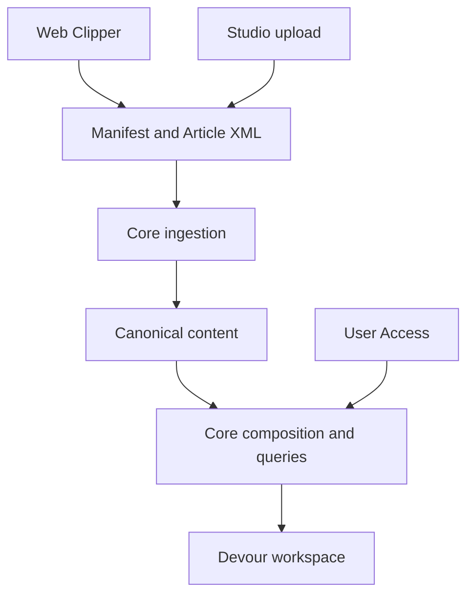

SNEWSE connects content capture, canonical processing, and user-facing exploration.
Use this map to find the owner of a behavior, then follow its guide for detail.
The [glossary](/glossary) provides a compact terminology reference.

## Applications and shared formats

| Area | Role | Start here |
| --- | --- | --- |
| Core | Owns canonical content, private user state, content access, and ingestion processing. | [Core architecture](/developer/core/overview) |
| Devour | Presents content and interactions through a navigable workspace. | [Devour architecture](/developer/devour/overview) |
| Web Clipper | Captures external content, lets you review it, and constructs submissions. | [Capture and review](/developer/web-clipper/capture) |
| Manifest | Defines shared captured-content meaning across producers and Core. | [Manifest bundles](/developer/manifest/bundles) and [Article XML](/developer/manifest/article-xml) |
| Shared packages | Supply contracts, XML parsing, browser transport, and small shared utilities. | [Shared packages](/developer/packages) |

Studio's current upload path also produces Manifest input. Its implementation
is linked from the [format guide](/developer/manifest/bundles); the upload path
does not define the scope of a future publisher product. Authentication and
the Account handoff are covered with [identity](/developer/core/authentication)
and [application setup](/operate/local-setup).

## Content and private state

Core's content owners and user-state owners collaborate without becoming the same
domain. These are the most useful destinations when tracing a feature:

| Question | Owning explanation |
| --- | --- |
| What was captured, and what is ready to compose? | [Articles](/developer/core/articles) |
| What text belongs to a semantic Unit? | [Units and Grafs](/developer/core/units) |
| How are entities assigned and discovered? | [Topics](/developer/core/topics) |
| How are Media metadata and bytes delivered? | [Media](/developer/core/media) |
| Which canonical resources can a user access? | [User Access](/developer/core/user-access) |
| How does a user organize accessible Articles? | [Collections](/developer/core/collections) |
| Where do private notes, highlights, and Tags live? | [Annotations and Tags](/developer/core/annotations) |
| How does a text selection retain its identity? | [Annotation anchors](/developer/core/annotation-anchors) |
| Where are producer-defined snapshots stored? | [Artifacts](/developer/core/artifacts) |
| How is a list filtered, ranked, and continued? | [Article queries](/developer/core/article-queries) and [Unit queries](/developer/core/unit-queries) |

## Follow work across owners

<Steps>
  <Step title="Capture and submit">
    [Web Clipper](/developer/web-clipper/submission) supplies a shared bundle.
    [Core capture](/developer/core/ingestion/capture) owns validation,
    normalization, persistence, acquisition, and placement outcomes.
  </Step>
  <Step title="Process and publish">
    The [worker](/developer/core/ingestion/worker) coordinates execution and
    recovery. [Semantic processing](/developer/core/ingestion/semantics) prepares
    and publishes derived Units, Topics, and related content facts.
  </Step>
  <Step title="Compose and explore">
    Core supplies authorized composition and list results.
    [Devour state](/developer/devour/state) owns their client-side lifecycle,
    and [workspace navigation](/developer/devour/workspace-navigation) owns
    which content surfaces are open.
  </Step>
</Steps>

This flow is an orientation, not a second definition of transaction or access
guarantees. Each stage's guide owns its failure cases and completion boundary.

## Infrastructure and execution boundaries

[Authentication](/developer/core/authentication) supplies identity, while
[User Access](/developer/core/user-access) supplies content grants.
[HTTP behavior](/developer/core/http) connects requests to product operations.
[Persistence and storage](/developer/core/persistence) explains the database and
object-storage mechanisms used by those owners.

[Operational telemetry](/developer/core/telemetry) explains diagnostic signals.
[Product analytics](/developer/core/analytics) explains product-event intake.
They have separate purposes and should be investigated through their own paths.

Core's semantic processing is also separate from Devour's interactive Wayfinder
surfaces. The [Wayfinder guide](/developer/devour/wayfinder) identifies the current
execution boundary; the presence of content queries and Artifact storage alone
does not establish an interactive runtime.
