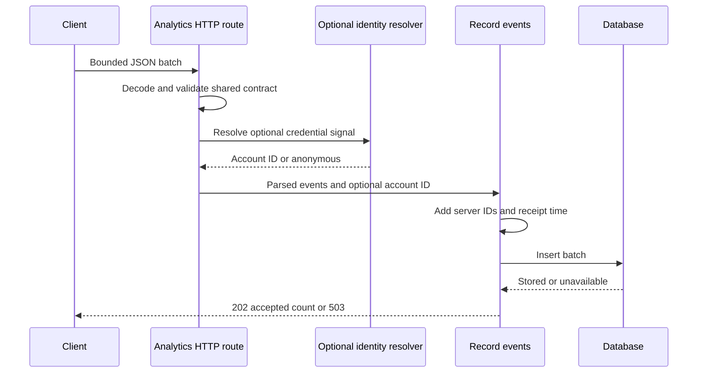

Core Analytics captures first-party product behavior through `POST /api/analytics/events`. It is a product capability with its own public contract and persistence. Operational request logs and traces describe system health and live on the [Operational telemetry](/developer/core/telemetry) boundary.

## Capture flow

The [route adapter](https://github.com/coreyconner/snewse/blob/master/apps/core/src/analytics/http/create-analytics-routes.ts) reads no more than 64 KiB of actual request bytes, decodes JSON, and applies the shared request schema once. The request contains between one and 25 events. Empty, malformed, structurally invalid, or oversized input returns a client-safe failure without calling persistence.

<Note>
  The browser send path can operate independently of application query state. Event capture is an append-style product signal, not a cached product read.
</Note>

## Contract validation

[`packages/contracts/src/analytics.ts`](https://github.com/coreyconner/snewse/blob/master/packages/contracts/src/analytics.ts) is the authority for event names, target types, required target identifiers, timestamps, anonymous session IDs, metadata bounds, and batch schemas. The contract checks that every event uses its matching target type and supplies the identifier required by that event.

Metadata is intentionally a small map of primitive or null values. The contract rejects unsafe key categories and bounds field count, key shape, string length, and serialized size. Consult the linked schema or generated [API reference](/developer/core/http#generated-api-reference) for exact current limits instead of duplicating them in a client.

## Anonymous and signed-in attribution

Events may be anonymous. An anonymous client can supply its own session UUID within the public schema. Core also asks Auth for optional account identity after the event batch validates.

If a valid session or bearer key is present, Core stores its referenced account ID. If no credential signal exists, or optional resolution fails, capture remains anonymous. This path does not authorize a resource read and does not make authentication a prerequisite for analytics. See [Authentication and identity](/developer/core/authentication#optional-identity).

## Persistence outcome

The [`record-product-analytics-events` operation](https://github.com/coreyconner/snewse/blob/master/apps/core/src/analytics/operations/record-product-analytics-events.ts) creates a server-owned UUID for each event and one receipt timestamp for the batch. A supplied valid occurrence time is preserved; otherwise occurrence time uses the receipt time. The operation builds private insert records and delegates one batch insert to its [focused persistence function](https://github.com/coreyconner/snewse/blob/master/apps/core/src/analytics/persistence/insert-product-analytics-events.ts).

On success, Core returns `202` with the accepted count. A database write failure returns a sanitized `503` and does not claim partial acceptance. Invalid input returns `400`, and an oversized body returns `413`.

The physical [`product_analytics_event` table](https://github.com/coreyconner/snewse/blob/master/apps/core/src/infrastructure/postgres/schema/analytics.ts) stores event and target vocabulary, occurrence and receipt times, optional anonymous and account attribution, optional resource identifiers, and metadata. Resource and account foreign keys use null-on-delete behavior so an event can remain after a referenced record is removed.

## Operational visibility

Analytics wraps storage with an operational capture span and records bounded event counts and outcomes: accepted, invalid, or storage unavailable. It does not copy event metadata or target payloads into operational telemetry. This lets operators diagnose intake health without collapsing product events into HTTP logs.

Exact event semantics beyond the shared contract depend on the emitting product surface. This Core page owns intake and storage behavior; it does not invent measurement policy or interpret product KPIs.
