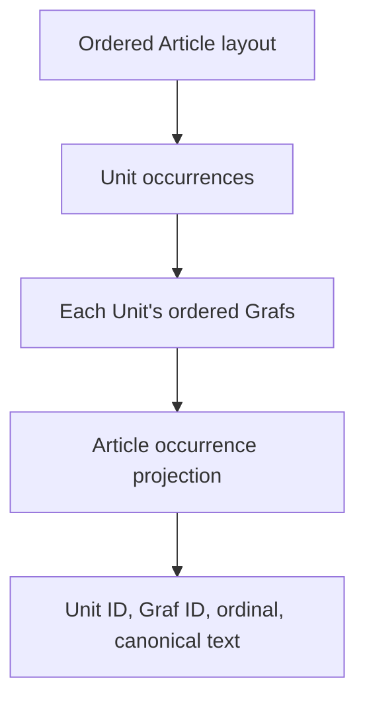

An annotation anchor records where one or more logical text selections belonged in an Article. Core builds coordinates over canonical Graf text, validates captured quote evidence at creation, and later resolves the immutable evidence against the Article's current canonical projection.

Anchor handling is exact. It does not use fuzzy text matching, similarity scoring, or cross-capture migration. [Annotations and Tags](/developer/core/annotations) owns the private aggregate and its mutations; this page owns the text-coordinate and resolution model.

## The canonical Article projection

Core derives a flat sequence of addressable Graf occurrences from a ready Article:

The projection walks Unit entries in Article layout order, then each Unit's Grafs in canonical order. Media entries contribute no text occurrence. If the same Unit appears twice in the layout, its Grafs appear twice with different occurrence ordinals. The `(unitId, grafId)` pair therefore identifies an addressable occurrence only when it appears exactly once.

The projection exists only for a ready Article. Broken ready composition, such as a missing layout or referenced Unit, is an integrity failure. The loader reuses the Units owner's canonical text rather than defining another transformation. See [Units and Grafs](/developer/core/units) and [`load-article-anchor-projection.ts`](https://github.com/coreyconner/snewse/blob/master/apps/core/src/articles/operations/load-article-anchor-projection.ts).

## Candidate coordinates and logical ranges

A captured segment identifies a Unit and Graf and supplies UTF-16 start and end offsets with the exact selected quote. One logical range can span consecutive addressable Grafs. An annotation can contain several logical ranges when unselected addressable text separates them.

Core normalizes submitted segments and ranges into canonical Article order. Within one annotation:

- each segment must identify exactly one meaningful Graf occurrence;
- offsets must fall within canonical Graf text and cannot split a UTF-16 surrogate pair;
- the exact quote must equal the text between the submitted offsets;
- a multi-segment range must remain continuous across the occurrence projection; and
- separate ranges cannot overlap or touch.

Continuity allows a selection to cross non-text layout content or whitespace-only Graf occurrences because neither contributes addressable text. It does not allow the range to skip meaningful Graf text. The detailed limits, wire shapes, and validation codes remain in the [`annotations` contract](https://github.com/coreyconner/snewse/blob/master/packages/contracts/src/annotations.ts); [`validate-anchor-candidate.ts`](https://github.com/coreyconner/snewse/blob/master/apps/core/src/annotations/internal/validate-anchor-candidate.ts) is authoritative for the algorithm.

## Immutable evidence

After validation, Core stores the exact quote and original selector together with bounded prefix and suffix context and a hash of the full canonical Graf text. It also assigns stable range and segment ordinals. These values describe the source at creation time; resolution does not rewrite them when text moves.

The coordinates deliberately have no foreign-key dependency on current Unit or Graf records. That lets Core report that an old location is missing instead of losing the annotation with the content it once addressed. A new capture has a new Article identity, so the resolver does not migrate anchors between captures.

## Resolution starts with the original occurrence

Core resolves each segment independently, using this order:

1. If the original `(unitId, grafId)` identifies more than one occurrence, the segment is unresolved as ambiguous.
2. If it identifies one occurrence and the original offsets still contain the exact quote, the selector resolves exactly.
3. If the occurrence exists but the offsets no longer match, Core searches that same occurrence for the exact quote. One match recovers directly. Multiple matches recover only when stored prefix and suffix context support exactly one.
4. Only when the original occurrence is missing does Core search the whole Article projection for the exact quote. Exactly one context-supported match recovers; zero or multiple supported matches remain unresolved.

When the original occurrence still exists, a failed same-occurrence search does not fall through to another Graf. This keeps recovery tied to the strongest available identity evidence. All quote and context comparisons are exact, including whitespace and Unicode code units.

<Note>
  Capture validation and later recovery are separate decisions. Creation rejects evidence that does not match the canonical Article projection at that time. Recovery evaluates already-stored evidence after the projection has changed.
</Note>

[`resolve-anchor.ts`](https://github.com/coreyconner/snewse/blob/master/apps/core/src/annotations/internal/resolve-anchor.ts) defines the resolver and its unresolved reasons, including a missing occurrence, missing quote, context mismatch, and ambiguous match.

## Partial and unresolved results

A segment reports one of three outcomes: exact at its stored selector, recovered at a current selector, or unresolved with a reason. A logical range resolves only when every segment resolves. The overall anchor state then follows the ranges:

| Overall state | Meaning |
| --- | --- |
| Resolved | Every range resolves completely. |
| Partially resolved | At least one range resolves completely and at least one does not. |
| Unresolved | No range resolves completely. |

This means a range with some located segments and one unresolved segment is itself unresolved. Those segment-level results remain available for diagnosis, but they do not make the range partially resolved. Partial resolution is an aggregate state across logical ranges.

Article-scoped annotation results order annotations with a current resolved position first. A partially resolved anchor uses the earliest position from its fully resolved ranges. Anchors with no resolved range follow, and unanchored Article notes come last. Creation time and annotation ID provide stable tie-breakers. The response assembly and ordering rules live in [`annotation-response.ts`](https://github.com/coreyconner/snewse/blob/master/apps/core/src/annotations/internal/annotation-response.ts).

<Columns cols={3}>
  <Card title="Annotations and Tags" icon="highlighter" href="/developer/core/annotations">
    See the aggregate that owns stored anchor evidence.
  </Card>
  <Card title="Units and Grafs" icon="blocks" href="/developer/core/units">
    Follow canonical Graf text and ordering.
  </Card>
  <Card title="Articles" icon="newspaper" href="/developer/core/articles">
    See the layout that supplies Unit occurrences.
  </Card>
</Columns>
