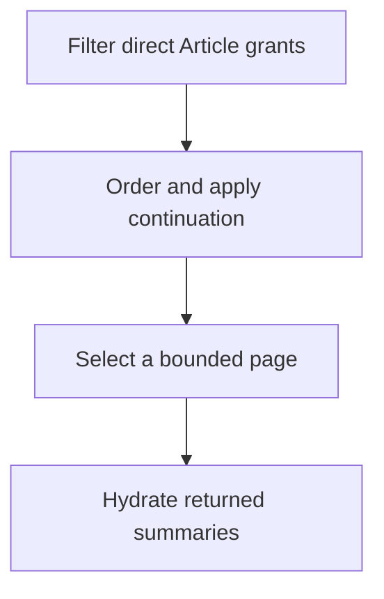

Article queries produce bounded lists from the Articles an authenticated user can access. They do not search the global Article table and then apply authorization afterward. Core builds the eligible set from the user's direct Article grants, narrows that set with every requested filter, orders it, and only then selects a page.

<Note>
  An Article query returns list summaries. It does not invoke Article composition or require a ready composition. See [Articles](/developer/core/articles) for exact Article detail and readiness behavior.
</Note>

## How an Article page is selected

The query persistence operation runs this work in a read-only, repeatable-read transaction. That gives source validation, candidate selection, and summary hydration one consistent database view. Core reads one candidate beyond the requested page to decide whether another page exists, then hydrates only the rows it will return.

The current [`readArticlePage`](https://github.com/coreyconner/snewse/blob/master/apps/core/src/queries/articles/persistence/read-article-page.ts) implementation defines that boundary. The [Article query contract](https://github.com/coreyconner/snewse/blob/master/packages/contracts/src/articles.ts) remains authoritative for accepted parameters, limits, defaults, and the exact response shape.

## Eligibility and filters

Direct Article access is the base condition. [User Access](/developer/core/user-access) explains how those grants form the User Library. A query may then add Collection, Topic, and Tag constraints. When several are present, an Article must satisfy all of them.

<Tabs sync={false}>
  <Tab title="Collection">
    Core first verifies that the Collection belongs to the authenticated user. It then retains only accessible Articles that are members of that Collection. An owned empty Collection returns an empty list; an unavailable Collection produces the route's private not-found result. Collection membership remains organization, not authorization. See [Collections](/developer/core/collections).
  </Tab>
  <Tab title="Topic">
    Core retains Articles with an exact Article-to-Topic assignment matching the supplied Topic key. The filter does not infer membership from related Units. This does not check a standalone Topic grant. A key with no matching accessible Articles yields an empty page. See [Topics](/developer/core/topics) for the separate access and assignment relationships.
  </Tab>
  <Tab title="Tag">
    Core first verifies that the Tag belongs to the authenticated user. It then checks that user's direct Tag assignment for each Article. [Annotation Tags](/developer/core/annotations#article-tags-and-annotation-tags-are-different-assignments) do not satisfy this filter. An owned empty Tag returns an empty list; an unavailable Tag uses the same private failure boundary as other unavailable owned inputs.
  </Tab>
</Tabs>

The filter implementations are deliberately separate: [Collection eligibility](https://github.com/coreyconner/snewse/blob/master/apps/core/src/queries/articles/filters/collections.ts), [Topic eligibility](https://github.com/coreyconner/snewse/blob/master/apps/core/src/queries/articles/filters/topics.ts), and [Tag eligibility](https://github.com/coreyconner/snewse/blob/master/apps/core/src/queries/articles/filters/tags.ts). This keeps each ownership rule visible instead of presenting the route as a general query language.

## Ordering and related ranking

Article queries support acquisition time, publication time, and semantic relatedness. Acquisition ordering uses the grant's original added time. Publication ordering places dated Articles before Articles without a publication time. Both descend by their primary time and use the Article ID as the stable final tie-breaker.

Related ordering is a separate path. Core verifies that the user can access the exact source Article independently of the result filters, reads its embedding, and excludes only that exact capture from the candidates. It then computes cosine distance across the complete filtered eligible set, ranks the smallest distance first, and uses Article ID to break equal distances. The source does not need to match the Collection, Topic, or Tag filters applied to results.

An accessible source with no usable vector produces an empty related page. Candidates without a rankable vector are absent from related results but remain eligible for time-ordered lists. The [related Article ranking expression](https://github.com/coreyconner/snewse/blob/master/apps/core/src/queries/articles/rankings/related.ts) and its use in [`readEligibleArticleRows`](https://github.com/coreyconner/snewse/blob/master/apps/core/src/queries/articles/persistence/read-article-page.ts) are the current source of truth.

## Continuation reflects a live eligible set

The next cursor is opaque continuation state. It records the complete ordering position and binds the order, every filter, and any related source to the query that created it. Core rejects a cursor reused with a different query identity, while allowing the caller to choose a different page size.

Each continued request rebuilds authorization and filter eligibility. A cursor therefore neither grants access nor freezes a snapshot. If access or membership changes between pages, the next page reflects the new eligible set. Continuation is based on stored ordering values and the Article ID, so deletion of the previous boundary row does not prevent progress.

Article cursors preserve database timestamp and distance precision rather than the lower precision used for display dates. They bind an exact Topic key through a fixed fingerprint so a valid long key does not make the cursor grow with it. [`article-cursor.ts`](https://github.com/coreyconner/snewse/blob/master/apps/core/src/queries/articles/article-cursor.ts) owns encoding, validation, and query binding.

## Summary hydration and integrity

After selecting the returned IDs, Core loads the public Article summary facts, ordered captured authorship, and optional cover image. It derives a display preview from the stored deck with the stored preview as fallback. If a cover exists, the query exposes its canonical Media content URL and available presentation metadata.

Hydration preserves owner invariants. A recorded cover without its Media record, or a cover with an invalid original representation, fails the request instead of inventing a thumbnail. The extra row used only to detect another page is not hydrated. Detailed Article layout, canonical Unit content, embeddings, and ranking distances stay outside the list result.

[`queryArticles`](https://github.com/coreyconner/snewse/blob/master/apps/core/src/queries/articles/query-articles.ts) composes the public items and cursor. The [integration tests](https://github.com/coreyconner/snewse/blob/master/apps/core/src/queries/articles/__tests__/query-articles.integration.test.ts) verify complete paging, live eligibility, filter binding, full-set related ranking, and returned-row-only hydration.

<Columns cols={3}>
  <Card title="Articles" icon="newspaper" href="/developer/core/articles">
    Follow exact Article composition and readiness.
  </Card>
  <Card title="Collections" icon="folders" href="/developer/core/collections">
    Understand private organization of accessible Articles.
  </Card>
  <Card title="Unit queries" icon="blocks" href="/developer/core/unit-queries">
    Compare the Unit-specific eligible set and hydration path.
  </Card>
</Columns>
