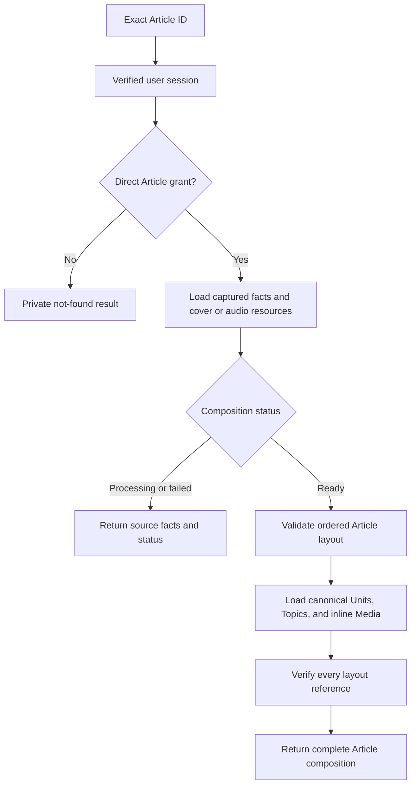

An Article is one immutable editorial capture and the container that determines how canonical content is assembled. The Articles owner keeps the captured facts, composition status, and ordered layout. It coordinates trusted reads from Units, Topics, and Media to produce the aggregate used by an Article view.

<Note>
  An Article UUID identifies one capture. The slug is descriptive metadata and does not select or authorize an Article.
</Note>

## Capture identity and source facts

`articleKey` groups captures that describe the same source item. During intake, Core compares the newest capture for that key with the submitted canonical plain text. An exact text match reuses the existing Article ID as `unchanged`; changed text creates another immutable capture with a new ID. The capture transaction orders versions by capture time and uses the Article ID as a stable tie-breaker.

Article detail keeps the public editorial facts available while composition is still underway, including the captured bylines in their original order and available cover or audio resources. Readiness therefore does not erase the identity and attribution of a capture.

Current manifest capture records retain a deeper provenance record: submitted source content, canonical source text and hash, and mappings from submitted references to canonical resources. That evidence supports ingestion and audit work. It does not expand Article detail or expose the internal publication process.

The [capture transaction](https://github.com/coreyconner/snewse/blob/master/apps/core/src/ingestion/capture/capture.ts) defines version resolution. The [Article schema](https://github.com/coreyconner/snewse/blob/master/apps/core/src/infrastructure/postgres/schema/article.ts) holds the persisted facts, while the [public contract](https://github.com/coreyconner/snewse/blob/master/packages/contracts/src/articles.ts) remains the authority for exact response fields.

## How Article composition works

For intake validation, capture commits, and retry consequences, see
[submission and capture](/developer/core/ingestion/capture).

The Article Composer serves one exact Article ID. It authorizes the Article once, reads its stored facts, and then follows the readiness boundary.

The implementation is split between [`composeArticle`](https://github.com/coreyconner/snewse/blob/master/apps/core/src/articles/operations/compose-article.ts), which owns the aggregate and its invariants, and the [Composer record read](https://github.com/coreyconner/snewse/blob/master/apps/core/src/articles/persistence/read-article-composer-record.ts), which validates stored layout data at the Article boundary. See [Core architecture](/developer/core/overview) for how named operations are wired into the process.

## Composition readiness

The response is a discriminated contract. `compositionStatus` tells consumers which fields are present, so a client does not need to infer readiness from an empty array or missing child.

<Tabs sync={false}>
  <Tab title="Processing">
    Core returns the captured source facts, cover image, and audio version when present. It omits `layout`, `units`, `topics`, and `mediaAttachments` because canonical composition is not available yet.
  </Tab>
  <Tab title="Failed">
    Core returns the same source-fact shape with `compositionStatus: "failed"`. Ingestion diagnostics and internal failure details are outside the public Article result.
  </Tab>
  <Tab title="Ready">
    Core requires a valid, nonempty layout and returns the complete composition: ordered layout references plus the canonical Unit, Topic, and inline Media resources those references need.
  </Tab>
</Tabs>

Readiness describes the composition of this capture. It does not change the Article's access rule: every state still requires a direct Article grant. [User Access](/developer/core/user-access) owns that grant and its propagation.

## Layout is the ordering authority

A ready layout is an ordered sequence of references with two forms: a Unit ID or a Media ID. The layout carries placement; the child arrays carry canonical resource content.

Core preserves every layout occurrence. If the same Unit or Media appears twice, the response keeps both references in their original positions. The Composer loads each distinct child once and returns one canonical resource for that ID, so consumers render by walking `layout` and resolving each reference against `units` or `mediaAttachments`.

Article-level cover and audio roles come from dedicated Article fields. Inline Media placement comes only from `layout`. Association with an Article makes a Media record eligible for use, but an unplaced association does not add a body block.

The Article owner delegates child content instead of rebuilding it:

- [Units and Grafs](/developer/core/units) supplies each Unit's canonical Graf order and text and verifies that the Unit originated from this Article.
- Topics supplies the Article's assigned references in canonical key order.
- Media supplies resource metadata for cover, audio, and inline references.

## Trusted child loading

The initial Article grant authorizes the aggregate. Trusted child operations therefore receive canonical IDs from the Article record and do not repeat standalone user authorization. They still enforce ownership and integrity boundaries. Unit loading checks the originating Article, and Media placement checks the Article's Media associations.

This trust is local to composition. A standalone Unit or Media request applies that resource's direct grant through [User Access](/developer/core/user-access). Access to a child resource does not authorize its parent Article, and a Collection remains an organizational view over Articles the user can already access. See [Collections](/developer/core/collections) for that distinction.

## Failure boundaries

The [Article HTTP adapter](https://github.com/coreyconner/snewse/blob/master/apps/core/src/articles/http/create-article-routes.ts) owns session, request-validation, and private-cache mechanics. Unknown Articles and Articles outside the user's grants share one private not-found result, so absence does not disclose another user's accessible corpus.

Once an Article is marked ready, the Composer treats its layout as a complete invariant. It fails the request as a server error when the layout is absent or malformed, a referenced Unit or Media is missing, a Unit belongs to another Article, or a placed Media record lacks the Article association. It does not return a partial composition or silently omit the broken reference.

The focused [Composer tests](https://github.com/coreyconner/snewse/blob/master/apps/core/src/articles/__tests__/compose-article.test.ts) cover readiness and occurrence preservation. The [integration tests](https://github.com/coreyconner/snewse/blob/master/apps/core/src/articles/__tests__/compose-article.integration.test.ts) exercise stored-data corruption and access isolation.

<Columns cols={3}>
  <Card title="Units and Grafs" icon="blocks" href="/developer/core/units">
    Follow canonical child composition and Graf text.
  </Card>
  <Card title="User Access" icon="key-round" href="/developer/core/user-access">
    Understand direct grants and derived access.
  </Card>
  <Card title="Core architecture" icon="network" href="/developer/core/overview">
    See how Core composes product owners.
  </Card>
</Columns>
