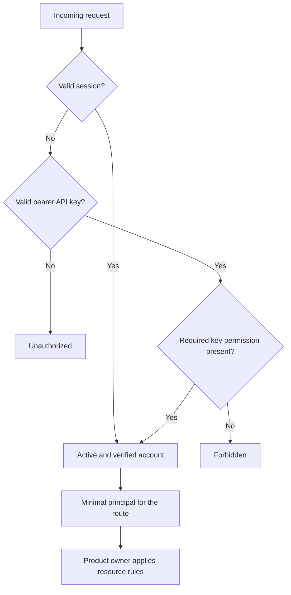

Core Auth owns shared identity, sessions, email verification, global roles, API keys, and the narrow guards and principals used by other Core owners. Better Auth stores authentication records and serves its native routes under `/api/auth/*`; Core adds SNEWSE lifecycle and credential rules around that runtime.

An authenticated account is identity, not resource access. After Auth supplies an `authUserId`, the product owner still decides whether that user owns a private record or has a materialized grant. See [User Access](/developer/core/user-access) for Article, Unit, Topic, and Media grants.

## Runtime and account lifecycle

The [Auth composition boundary](https://github.com/coreyconner/snewse/blob/master/apps/core/src/infrastructure/auth/create-auth.ts) connects Better Auth to the shared Drizzle runtime and returns route guards plus identity resolvers. Runtime construction is lazy: importing Auth does not open a connection or acquire environment configuration.

The [Better Auth runtime](https://github.com/coreyconner/snewse/blob/master/apps/core/src/infrastructure/auth/runtime.ts) currently provides email/password accounts, verification and reset delivery, session handling, administrator roles, API keys, and Better Auth's OpenAPI schema. Password reset revokes existing sessions.

Protected user operations accept only an active account with a verified email. A missing or invalid session returns `401`; a banned account or unverified email returns `403`. These lifecycle checks run when Core resolves a principal, not inside each product operation.

<Note>
  Editorial authorship is content identity. It does not imply a login account or a Core authorization role.
</Note>

## Account creation and recovery

Public email signup is disabled by default. When the configured mode is `allowlist`, the Better Auth pre-hook accepts exact email addresses or whole domains from the configured allowlist. The hook runs inside the Auth boundary for HTTP and native server API calls, so another frontend cannot bypass it by invoking Better Auth differently.

Verification and password-reset messages use the configured Auth email sender. Local environments may use the development delivery path. Production-like environments require a non-development Better Auth secret and webhook delivery configuration. Delivery failures are reduced to a safe error before Better Auth can log them, keeping callback tokens, webhook credentials, and provider payloads out of diagnostic output.

The exact environment parsing, origin handling, rate limits, and delivery requirements live in [`policy.ts`](https://github.com/coreyconner/snewse/blob/master/apps/core/src/infrastructure/auth/policy.ts) and [`config.ts`](https://github.com/coreyconner/snewse/blob/master/apps/core/src/infrastructure/auth/config.ts). Bootstrap commands belong in the operating guide rather than this identity model.

## Sessions and service credentials

<Tabs sync={false}>
  <Tab title="Verified session">
    A session represents a signed-in Better Auth user. Session-only routes resolve it to `{ authUserId }` after checking that the account is active and email-verified. User-owned resources require this principal because an API key does not prove interactive ownership.
  </Tab>
  <Tab title="Service API key">
    Core verifies a bearer token through Better Auth, resolves its referenced user, and applies that account's lifecycle state. Protected write use requires the `snewse:write` permission. A key with missing permission is forbidden; an invalid key is unauthorized.
  </Tab>
</Tabs>

When a request presents a valid session, credential resolution uses it before considering a bearer key. Publisher-write authorization then accepts a service key with `snewse:write`, or a session whose global role includes `admin`, `editor`, or `author`. Manifest intake accepts either credential form and passes the resolved account ID to submission.

The [credential resolver](https://github.com/coreyconner/snewse/blob/master/apps/core/src/infrastructure/auth/access.ts) is the mechanical authority for precedence, lifecycle checks, write roles, and principal shapes.

## Optional identity

Product analytics may accept an anonymous request. If the request contains a cookie or authorization signal, Auth tries to resolve it and returns an account ID only for a valid credential. Resolution failure becomes anonymous attribution rather than an authentication error. This resolver does not grant access and should not replace a required route guard.

## Boundary with HTTP and product owners

Auth returns small capabilities to application composition: session and write guards, a manifest-submitter guard, a required-session resolver, an optional identity resolver, and Better Auth routes. [HTTP API behavior](/developer/core/http) explains how route adapters apply these capabilities. Product operations receive the resulting principal or account ID; they do not receive Better Auth's runtime, cookies, or session model.
