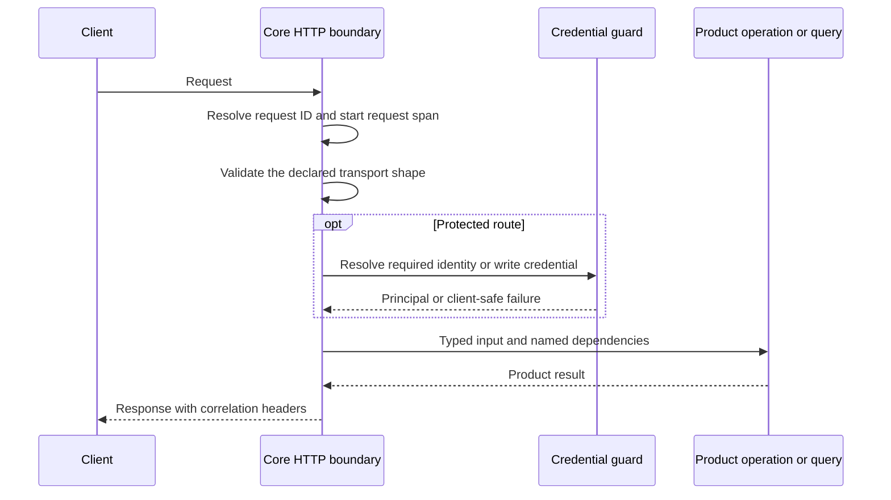

Core's HTTP application is the transport boundary for product operations and queries. It constructs their runtime dependencies, mounts each owner's route adapter, and applies shared validation, error, correlation, health, and OpenAPI behavior. Product meaning remains with the operation or query behind the route.

The [`createCoreHttpApp` composition root](https://github.com/coreyconner/snewse/blob/master/apps/core/src/app/create-http-app.ts) creates one Hono application. It supplies focused operations to route factories for Analytics, Annotations, Artifacts, Collections, Ingestion, Articles, Topics, Media, Units, and the Article and Unit query families. Better Auth contributes its own routes under `/api/auth/*`.

<Note>
  This page explains behavior shared by the HTTP boundary. For what a resource operation returns or authorizes, follow the corresponding page from the [Core architecture guide](/developer/core/overview).
</Note>

## From request to operation



Route adapters translate between HTTP and a named use case. Shared public request and response schemas come from [`@snewse/contracts`](https://github.com/coreyconner/snewse/tree/master/packages/contracts/src). Each owner registers its route and OpenAPI metadata; shared adapters supply the standard error and correlation components. This keeps runtime validation, generated API documentation, and client types anchored to the same wire contract without treating database rows as API models.

## Validation and errors

OpenAPI routes validate their declared parameters and bodies at the HTTP boundary. The shared validation hook maps problems to a client-safe JSON envelope:

```json
{
  "error": "Client-safe message",
  "issues": [{ "path": "field", "message": "Problem" }]
}
```

`issues` appears when field-level validation detail can help a client identify the invalid input. The [shared error contract](https://github.com/coreyconner/snewse/blob/master/packages/contracts/src/apiError.ts), [OpenAPI adapters](https://github.com/coreyconner/snewse/blob/master/apps/core/src/infrastructure/http/openapi/support.ts), and [HTTP error handler](https://github.com/coreyconner/snewse/blob/master/apps/core/src/infrastructure/http/errors.ts) define the current mechanics.

Some routes use the [bounded request-body intake](https://github.com/coreyconner/snewse/blob/master/apps/core/src/infrastructure/http/api-request-body.ts) before parsing. It measures actual streamed bytes instead of trusting `Content-Length`, cancels an oversized stream, and distinguishes oversized, empty, malformed, and unreadable input. A route still owns its limit and content-type behavior; consult its registered OpenAPI description for the exact contract.

Unexpected failures become a generic `500` response. The handler does not expose stack traces, database details, provider responses, object-storage details, credentials, or request bodies.

## Private route responses

Routes that return user-scoped state apply `Cache-Control: private, no-store` to success and error responses. This includes Article and Unit query collections and the private Annotation and Tag family. The header is applied around the session guard, so an authentication failure is not accidentally cacheable either.

Owner adapters also preserve private absence. For example, an inaccessible query source or Annotation resource maps to the same client-safe unavailable result as a missing one. The route translates known owner errors to their declared status and envelope while the shared handler sanitizes unexpected failures. See the current [Article query adapter](https://github.com/coreyconner/snewse/blob/master/apps/core/src/queries/articles/http/create-article-query-routes.ts), [Unit query adapter](https://github.com/coreyconner/snewse/blob/master/apps/core/src/queries/units/http/create-unit-query-routes.ts), and [Annotation adapter](https://github.com/coreyconner/snewse/blob/master/apps/core/src/annotations/http/create-annotation-routes.ts) for the exact parameters and response declarations.

Annotation mutations add a raw 256 KiB request cap before their contract schema validates fields. This pre-parse byte boundary is separate from note, range, and Tag limits inside the decoded payload. It protects the HTTP intake path even when a body is streamed or its `Content-Length` is absent or understated; the shared constant remains in the [Annotation contract](https://github.com/coreyconner/snewse/blob/master/packages/contracts/src/annotations.ts).

## Authentication at the route boundary

Route factories receive only the guard or identity resolver their endpoints need. A session guard places an authenticated user principal into Hono context. Manifest intake receives a principal resolved from either a verified session or an accepted service credential. Publisher write guards validate global write eligibility without deciding resource-specific access.

Authentication proves identity and lifecycle state. It does not create access to an Article, Unit, Topic, or Media item. [Authentication and identity](/developer/core/authentication) describes those credential paths, while [User Access](/developer/core/user-access) owns materialized resource grants.

## Request correlation

Every completed response receives `X-Request-ID`. A client-supplied value is retained only when it matches the bounded safe format enforced by [`resolveRequestId`](https://github.com/coreyconner/snewse/blob/master/apps/core/src/infrastructure/http/request-telemetry.ts); otherwise Core creates a UUID.

The same middleware records method, matched route template, status, duration, sanitized error type, and active trace context. Unmatched paths collapse into `/api/*`, `/media/*`, or `/*` so arbitrary URLs do not become telemetry dimensions. `Server-Timing` reports request duration and, when tracing is active, the W3C `traceparent` value that browser telemetry can use for correlation.

<Info>
  `X-Request-ID` links an HTTP response to structured request diagnostics. A worker uses run and worker identifiers instead because it does not process the submission through a local HTTP call. See [Operational telemetry](/developer/core/telemetry).
</Info>

## Liveness and readiness

<Tabs sync={false}>
  <Tab title="Liveness">
    `GET /api/healthz` reports that the Core API process can answer requests. It does not contact PostgreSQL, object storage, Better Auth, or model providers.
  </Tab>
  <Tab title="Readiness">
    `GET /api/readyz` checks PostgreSQL and configured object storage. It returns `503` with a per-dependency status when a required check is unavailable. Object storage reports `not_configured` when no storage configuration exists, which does not make the API unready.
  </Tab>
</Tabs>

The [health routes](https://github.com/coreyconner/snewse/blob/master/apps/core/src/infrastructure/http/health/health-routes.ts) aggregate status. PostgreSQL and object storage retain their own narrow readiness operations and sanitize dependency errors before those errors enter telemetry or the response.

## Generated API reference

`GET /api/openapi.json` returns the generated OpenAPI 3.1 document assembled from the live first-party route registry. `GET /api/docs` serves a Scalar reference with that document and Better Auth's generated schema as separate sources. Both routes remain available without a working database because documentation delivery is transport infrastructure, not a readiness check.

For the exact current endpoint catalog, schemas, security declarations, and responses, use the generated reference or inspect the [OpenAPI configuration](https://github.com/coreyconner/snewse/tree/master/apps/core/src/infrastructure/http/openapi). The developer guides explain behavior and ownership instead of duplicating that mechanical catalog.
