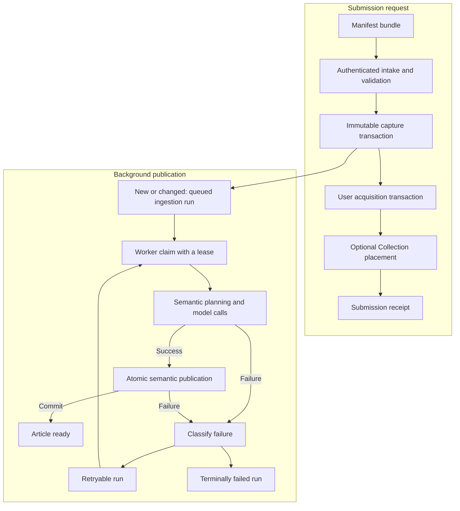

Ingestion turns a submitted manifest bundle into an immutable Article capture and then publishes its canonical Units, Topics, embeddings, preview, and layout. The HTTP request and the manifest worker are separate processes: a successful submission can return while semantic work is still queued.

The submission path establishes durable capture identity before the worker begins. The request validates the bundle, commits a new or changed capture when necessary, grants the submitting user access, and applies optional Collection intent. It then returns a receipt that identifies the captured Article and reports its intake status. See [capture and submission](/developer/core/ingestion/capture) for the commit and cleanup boundaries.

The worker claims queued or retryable runs explicitly. It performs model-dependent work outside the final database transaction, saves the stable Unit plan as a checkpoint, and publishes the complete semantic result only while its lease is still valid. See [worker execution](/developer/core/ingestion/worker) for claims and recovery, and [semantic publication](/developer/core/ingestion/semantics) for the content invariants.

<Note>
  A submission receipt confirms intake outcomes. It does not promise that semantic publication has completed. Use the Article's composition status to distinguish captured facts from a ready composition; [Articles](/developer/core/articles) owns that contract.
</Note>

## Two durable timelines

The request timeline and the publication timeline meet at the queued run, but they have different success boundaries.

| Timeline | Durable outcome | A later failure preserves |
| --- | --- | --- |
| Submission | Capture identity, source provenance, user acquisition, and any completed Collection placement | Every earlier committed transaction |
| Publication | Canonical Units and Topics, embeddings, preview, layout, access propagation, and ready status | The immutable capture and the worker's retry state or terminal failure |

This separation lets a changed capture survive provider downtime and lets a Collection placement retry without recreating the Article. [User Access](/developer/core/user-access) owns grants and their propagation; [Collections](/developer/core/collections) owns user organization.

## Where to go next

<Columns cols={2}>
  <Card title="Capture and submission" icon="inbox" href="/developer/core/ingestion/capture">
    Understand identity, media preparation, transaction order, and receipts.
  </Card>
  <Card title="Worker execution" icon="rotate" href="/developer/core/ingestion/worker">
    Follow claims, fences, checkpoints, retries, recovery, and shutdown.
  </Card>
  <Card title="Semantic publication" icon="sparkles" href="/developer/core/ingestion/semantics">
    See how captured content becomes canonical Units, Topics, and Article composition.
  </Card>
  <Card title="Manifest bundles" icon="package" href="/developer/manifest/bundles">
    Learn the submission envelope and how it relates to Article XML.
  </Card>
</Columns>

The [ingestion route](https://github.com/coreyconner/snewse/blob/master/apps/core/src/ingestion/http/routes.ts), [submission operation](https://github.com/coreyconner/snewse/blob/master/apps/core/src/ingestion/operations/submit-manifest-bundle.ts), and [worker](https://github.com/coreyconner/snewse/blob/master/apps/core/src/ingestion/worker/worker.ts) are the current implementation entry points. [Core architecture](/developer/core/overview) explains how the API and worker processes are composed.
