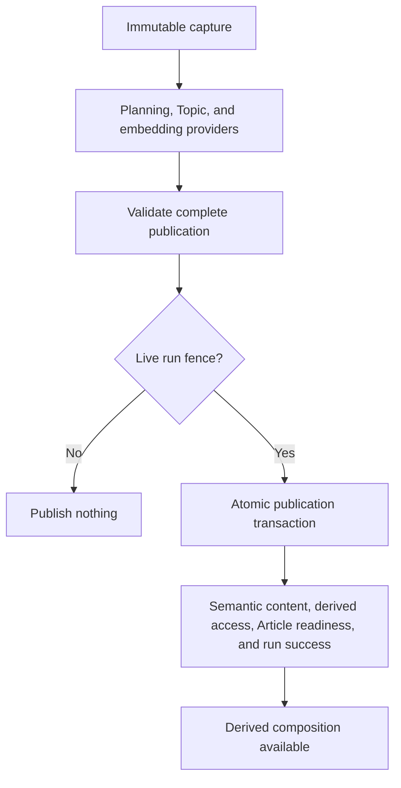

Semantic processing turns one immutable Article capture into its canonical composition. The worker treats model output as proposed work: it reconstructs the captured source, validates every stage, and publishes only a complete result while its run lease remains valid.

## Processing stages

<Steps>
  <Step title="Reload the immutable capture">
    Core reparses the stored Article XML and manifest, verifies current capture references, and maps submitted Graf and Media keys back to their canonical IDs. Semantic work therefore starts from persisted evidence rather than the original request process.
  </Step>
  <Step title="Plan canonical Units">
    Figure placement splits the Article body into consecutive Graf segments. The planning provider groups each text segment into Units, while Core requires every captured Graf exactly once, in source order, and allocates canonical Unit IDs. The completed plan becomes the stable retry checkpoint.
  </Step>
  <Step title="Extract and assign Topics">
    Core extracts people, institutions, and places concurrently, deduplicates exact Topic keys, and asks for one assignment result per planned Unit. Assignments may use only the extracted keys and cannot repeat a Topic within one Unit.
  </Step>
  <Step title="Create embeddings">
    Core embeds the Article text, every Graf, every Topic label, and every Unit's canonical text in bounded batches. It verifies the provider profile, result count, vector dimensions, and finite values before continuing.
  </Step>
  <Step title="Derive the preview and publication input">
    The preview uses the first nonempty Graf excerpt in Article layout order. A captured deck remains authoritative when present. Core then assembles the full planned layout, topics, assignments, and embeddings for validation.
  </Step>
  <Step title="Publish atomically">
    One fenced transaction validates the complete result against the capture, writes semantic content and derived access, marks the Article ready, and completes the run.
  </Step>
</Steps>

The [semantic pipeline](https://github.com/coreyconner/snewse/blob/master/apps/core/src/ingestion/semantic/pipeline.ts) coordinates these stages. [Units and Grafs](/developer/core/units) owns the canonical Unit text and Graf membership that publication produces.

## Unit planning preserves source order

A model may choose semantic grouping inside a consecutive text segment, but it cannot move a Graf across a figure or change source order. Core expands the planned layout and verifies that it reproduces the captured sequence of every Graf and inline Media occurrence. Every Unit must contain at least one Graf, and every captured Graf must belong to exactly one Unit.

The checkpoint fixes both the grouping and allocated Unit IDs across attempts. If a later provider fails, a retry begins with the same canonical plan instead of producing a second interpretation of Unit identity. The [publication validator](https://github.com/coreyconner/snewse/blob/master/apps/core/src/ingestion/worker/persistence/finalization/validate-publication.ts) defines the complete source-to-publication invariant.

## Topics and embeddings remain provider-bounded

Provider calls run before the final database transaction. Core selects providers through named capabilities and versioned prompt assets, then validates their structured results at its own boundary. Exact model choices and prompts remain in the [model registry](https://github.com/coreyconner/snewse/blob/master/apps/core/src/ingestion/semantic/model-registry.ts) and [prompt assets](https://github.com/coreyconner/snewse/blob/master/apps/core/src/ingestion/semantic/prompts.ts), where they can change without redefining the publication contract.

Topic identity uses an exact canonical key. When a key already exists, publication reuses the stored Topic and preserves its existing label and embedding. A type disagreement for the same key is corruption and rolls publication back; Core does not rewrite the stored winner to fit the current provider result.

Article Topic membership is the distinct projection of the Topics assigned to its Units. Direct Unit holders receive access only to Topics assigned to those Units; Article holders receive the complete published Unit set and its Topics through grant propagation.

Embedding validation is similarly local. The [embedding boundary](https://github.com/coreyconner/snewse/blob/master/apps/core/src/ingestion/semantic/embeddings.ts) rejects profile, count, dimension, or numeric mismatches before persistence. Failed provider work flows through the [worker's retry and failure rules](/developer/core/ingestion/worker).

<Note>
  A provider response does not make derived semantic composition available. That composition becomes canonical only after Core validates the whole publication input and the fenced final transaction commits.
</Note>

## Atomic publication boundary

The transaction locks the exact live run attempt and its Article, then rechecks the lease after waiting for those locks. It rejects missing or already-ready targets and validates fresh checkpoint state against the captured Grafs and Media. A late lease loss, validation failure, Topic conflict, or write failure rolls back every semantic and readiness change together.

Publication derives Unit and Topic grants from users who can already access the Article, preserving earlier direct grants and acquisition times. [User Access](/developer/core/user-access) owns those rules. The transaction does not replace captured Article facts, source XML, Media records, Collection membership, or unrelated private state such as annotations.

The [semantic finalizer](https://github.com/coreyconner/snewse/blob/master/apps/core/src/ingestion/worker/persistence/finalization.ts) is the authority for this write set and its fence. [Articles](/developer/core/articles) explains how the completed layout becomes a ready composition.

## Failure boundaries

Invalid model output fails before publication. A retry may recompute Topics and embeddings, but it reuses the validated Unit-plan checkpoint. A lost fence stops the stale attempt without recording a competing failure. Database errors are classified for the run lifecycle, and persisted failure details omit bound source text and vector values.

Because finalization is atomic, Core never exposes a half-published composition. An Article stays processing for retryable work or becomes failed after a terminal outcome; its immutable captured facts remain available according to the [Article readiness contract](/developer/core/articles).

<Columns cols={3}>
  <Card title="Ingestion lifecycle" icon="route" href="/developer/core/ingestion/overview">
    Place semantic work in the end-to-end flow.
  </Card>
  <Card title="Manifest worker" icon="rotate" href="/developer/core/ingestion/worker">
    Understand the lease and retry boundary.
  </Card>
  <Card title="Article XML" icon="file-code" href="/developer/manifest/article-xml">
    Review the captured content source.
  </Card>
</Columns>
