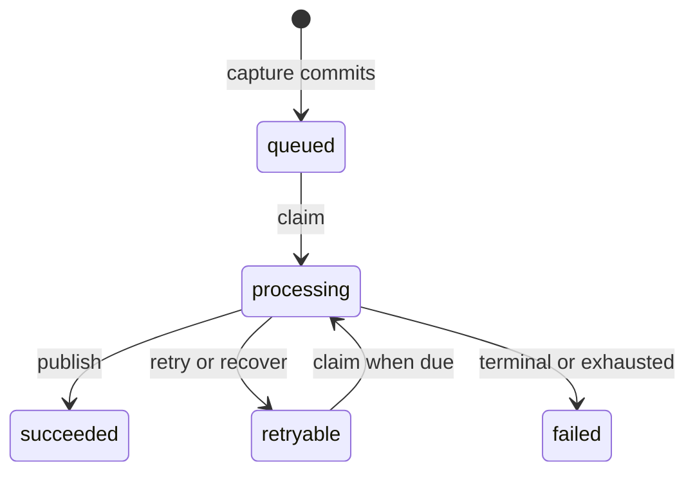

The manifest worker advances queued captures through semantic processing. It runs as a separate application from the Core HTTP API and claims work from persisted ingestion runs. A live lease and attempt number fence every state change, so an expired worker cannot publish or rewrite a reclaimed run.

## Run lifecycle

The run records both a status and a semantic stage. Status controls scheduling; stage shows the last validated processing boundary. Claimers select due queued or retryable work in stable creation order and skip rows another worker has locked. A successful claim increments the attempt and records the worker, lock time, and lease expiry.

See the [run schema](https://github.com/coreyconner/snewse/blob/master/apps/core/src/infrastructure/postgres/schema/manifest-ingestion.ts) for exact states and the [run lifecycle implementation](https://github.com/coreyconner/snewse/blob/master/apps/core/src/ingestion/worker/persistence/run-lifecycle.ts) for current scheduling limits and timing defaults.

## The lease is the write fence

Every checkpoint, failure update, and final publication must match the run ID, worker ID, attempt number, processing status, and an unexpired lease. A mismatch returns control without changing the run. This protects a later claimant when an earlier worker resumes after expiry or loses time while waiting for a database lock.

The worker checks the fence between major semantic stages. If a checkpoint write reports a lost fence, it stops before calling downstream providers or finalization. The final publication transaction locks and rechecks the same fence before and after assembling its writes, so lease expiry rolls the entire publication back.

<Note>
  A lease does not make external model calls transactional. It determines which attempt may persist progress and publish. [Semantic publication](/developer/core/ingestion/semantics) explains how Core validates provider results before the final transaction.
</Note>

## Checkpoint and resume behavior

The worker persists the completed Unit plan as its resumable checkpoint. That checkpoint contains the allocated canonical Unit IDs and ordered Graf membership. A retry reloads it instead of planning again, which keeps later Topic assignments, embeddings, and publication tied to stable Unit identities.

Other model results are recomputed on a retry. Core validates stored checkpoint data before claiming or advancing a run; malformed resumable state aborts without silently replacing the evidence. [Units and Grafs](/developer/core/units) defines the canonical content produced from the plan.

## Failure outcomes

<Tabs sync={false}>
  <Tab title="Retryable">
    A retryable error with attempts remaining returns the run to `retryable` and schedules its next eligible claim with bounded backoff. The Article remains processing unless it already has a terminal readiness state from an earlier completed run.
  </Tab>
  <Tab title="Terminal">
    A nonretryable error or exhausted attempt budget marks the run failed. Core marks the Article failed only when no earlier terminal Article state takes precedence.
  </Tab>
  <Tab title="Lease lost">
    The attempt no longer owns the run. It records no failure and does not publish. The current claimant or stale-run recovery owns the next transition.
  </Tab>
</Tabs>

Failure details are persisted on the run after validation and sanitization. Provider or database errors do not authorize a partial semantic result. The worker reports the outcome that persistence accepted, including the case where a concurrent lease change prevents its failure update.

## Stale-run recovery

The daemon recovers expired processing runs at startup and periodically while it operates. Recovery processes a bounded set in expiry order, skips rows locked by another transaction, preserves a valid Unit-plan checkpoint, and moves each run to retryable or failed according to its remaining attempt budget.

Recovery and ordinary failure updates change the run and its Article readiness together. When several runs exist for one Article, a ready or failed Article keeps terminal precedence over a newly claimed or recovered run. This prevents maintenance work from regressing a composition users could already observe.

The same lifecycle supports an isolated recovery command. Exact command names, flags, batch bounds, and environment settings belong to the [worker CLI](https://github.com/coreyconner/snewse/blob/master/apps/core/src/ingestion/cli/run-worker.ts), [recovery CLI](https://github.com/coreyconner/snewse/blob/master/apps/core/src/ingestion/cli/recover-stale.ts), and [runtime configuration](https://github.com/coreyconner/snewse/blob/master/apps/core/src/ingestion/cli/worker-daemon-config.ts).

## Cancellation and shutdown

The daemon bounds concurrent claims and uses capped idle backoff when no work is due. A shutdown signal aborts polling, starts no new pass, and waits for every active worker in the current pass to settle. The worker session then removes signal handlers and closes its database and telemetry resources, including when the daemon itself fails.

Shutdown does not manufacture a successful run transition. An interrupted attempt either completed a fenced persistence action or remains available for lease expiry and recovery. The [daemon](https://github.com/coreyconner/snewse/blob/master/apps/core/src/ingestion/worker/daemon.ts) and [worker session](https://github.com/coreyconner/snewse/blob/master/apps/core/src/ingestion/cli/worker-session.ts) define that process lifecycle.

<Columns cols={3}>
  <Card title="Ingestion lifecycle" icon="route" href="/developer/core/ingestion/overview">
    See where the worker begins after submission.
  </Card>
  <Card title="Capture and submission" icon="inbox" href="/developer/core/ingestion/capture">
    Understand the immutable input and queued run.
  </Card>
  <Card title="Semantic publication" icon="sparkles" href="/developer/core/ingestion/semantics">
    Follow the stages guarded by the run fence.
  </Card>
</Columns>
