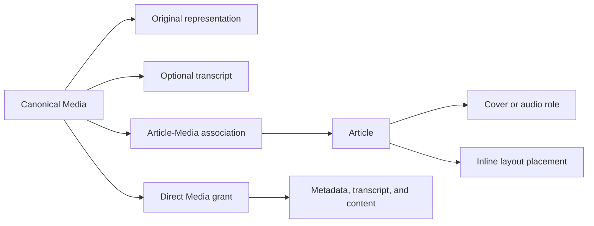

A Media record is a canonical audio, image, or video resource. It combines editorial metadata with one original representation and an optional transcript. Article associations define which Articles may use the resource; direct Media grants govern standalone metadata, transcript, and content requests.

<Note>
  Association, placement, and access answer different questions. An Article–Media association permits use by that Article. Dedicated Article fields and layout references choose presentation. A direct Media grant authorizes standalone reads.
</Note>

## Resource and association model

The Media record holds identity, type, and editorial fields such as title, caption, alternative text, and credit. Its original representation holds delivery facts, dimensions when known, and the location used to deliver the original. A transcript is a separate optional record attached to the Media identity.

The [Media schema](https://github.com/coreyconner/snewse/blob/master/apps/core/src/infrastructure/postgres/schema/media.ts), [Article–Media association](https://github.com/coreyconner/snewse/blob/master/apps/core/src/infrastructure/postgres/schema/article-media.ts), and [public Media contract](https://github.com/coreyconner/snewse/blob/master/packages/contracts/src/media.ts) are authoritative for exact fields and constraints.

An association alone does not put Media into an Article body. Cover and audio resources come from dedicated Article fields, while inline occurrences come from the ordered Article layout. The Article Composer verifies that every selected role and inline occurrence is associated with the Article before returning the aggregate. [Articles](/developer/core/articles) owns those placement and composition rules.

## Standalone reads authorize Media

Every standalone Media operation checks the caller's direct Media grant before reading the resource. Parent Article access is not a substitute for that grant. Conversely, a direct Media grant can authorize the resource without authorizing an associated Article.

The standalone surfaces separate metadata, transcripts, and bytes:

| Surface | Result |
| --- | --- |
| Metadata | Editorial resource facts, dimensions, content URL, source provenance, and transcript availability. It omits storage pointers and content bytes. |
| Transcript | Stored transcript text when nonblank; absence and whitespace-only text both mean no transcript. |
| Content | The original bytes from object storage or a redirect to an eligible external original. |

Unknown and inaccessible Media share the same private not-found behavior. Exact response shapes and HTTP mechanics remain in the [Media contract](https://github.com/coreyconner/snewse/blob/master/packages/contracts/src/media.ts) and [Media routes](https://github.com/coreyconner/snewse/blob/master/apps/core/src/media/http/create-media-routes.ts).

## Original content delivery

Core serves the original representation through one authorization boundary, then chooses delivery from the persisted representation.

<Tabs sync={false}>
  <Tab title="Stored original">
    A complete object-storage pointer is authoritative even when the record also retains an external source URL as provenance. Core streams the stored object and forwards a valid single byte range, which supports seeking in audio and video. Invalid or multiple ranges are ignored; an unsatisfiable range is returned without exposing an upstream response body.
  </Tab>
  <Tab title="External original">
    When every storage-pointer field is absent, Core may redirect to a credential-free HTTPS source URL. Core does not fetch that external object. An unsafe or malformed URL fails through the same sanitized content-unavailable boundary as an invalid representation.
  </Tab>
</Tabs>

Storage configuration and upstream failures are converted into private, bounded service errors. Core exposes only selected range and length headers plus the representation's stored MIME type. It does not forward an object-store error body or internal bucket and key details. [`deliverMediaContent`](https://github.com/coreyconner/snewse/blob/master/apps/core/src/media/operations/deliver-media-content.ts) defines the exact delivery and failure behavior.

## Trusted loading during Article composition

Article composition uses [`loadMediaResources`](https://github.com/coreyconner/snewse/blob/master/apps/core/src/media/operations/load-media-resources.ts) after the parent Article has been authorized. This trusted loader does not repeat standalone Media authorization. It receives canonical IDs from the Article owner and returns the compact resources needed for cover, audio, and inline presentation.

The loader preserves caller order and repeated IDs while deduplicating the persistence read. It requires every requested Media record to exist and to have exactly one original representation; missing or malformed resources fail the aggregate instead of being silently dropped. The Article owner separately verifies every role and inline Media association.

This trust applies only inside the authorized aggregate. Following a Media content URL still enters the standalone content operation and requires the user's direct Media grant. [User Access](/developer/core/user-access) explains how Article acquisition materializes those child grants.

## Capture, format, and lifecycle boundaries

Submission capture prepares Media, records its original representation, and creates Article associations. Bundle files become stored objects; eligible URL-backed entries remain external. The [submission and capture guide](/developer/core/ingestion/capture) owns preparation, storage setup, transaction behavior, and retry consequences.

The formats define what a producer may submit and how XML refers to Media:

- [Manifest bundles](/developer/manifest/bundles) explains bundle Media, file and URL sources, and producer/consumer responsibilities.
- [Article XML](/developer/manifest/article-xml) explains figures, ordered inline references, and format validation.

After capture, semantic publication and Article composition operate on canonical Media IDs and associations rather than reopening the submission format. [Ingestion lifecycle](/developer/core/ingestion/overview) shows where those stages meet, and [worker execution and recovery](/developer/core/ingestion/worker) owns background execution behavior.

<Columns cols={3}>
  <Card title="Articles" icon="newspaper" href="/developer/core/articles">
    See how roles, layout, and associations shape the aggregate.
  </Card>
  <Card title="Submission and capture" icon="inbox-arrow-down" href="/developer/core/ingestion/capture">
    Follow Media preparation and storage decisions.
  </Card>
  <Card title="User Access" icon="key-round" href="/developer/core/user-access">
    Understand standalone Media grants.
  </Card>
</Columns>
