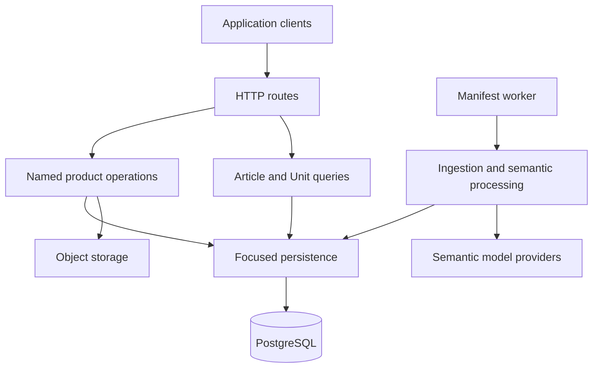
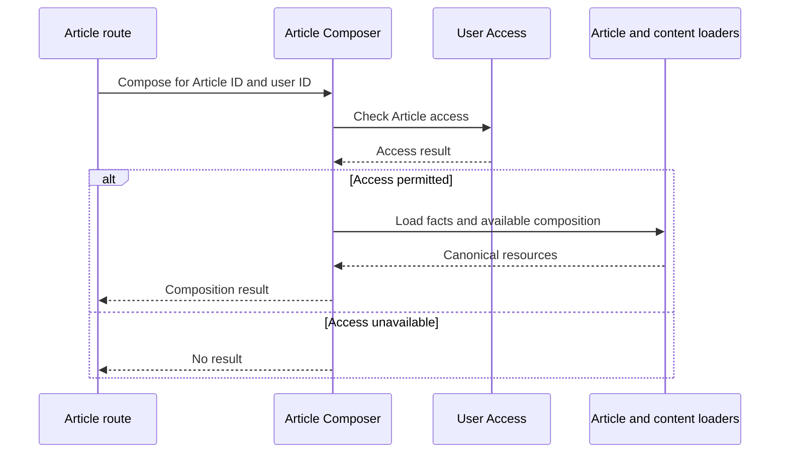

Core stores and serves SNEWSE content, manages user-owned state, and processes
captured content into semantic Units and Topics. Application composition connects
focused product operations to HTTP routes and background workers.

Use this page to locate a responsibility and follow how its collaborators are
assembled. The focused guides explain the product behavior:

<Columns cols={2}>
  <Card title="Articles" href="/developer/core/articles">
    Captured facts, composition readiness, and ordered content.
  </Card>
  <Card title="Units and Grafs" href="/developer/core/units">
    Canonical content and standalone Unit composition.
  </Card>
  <Card title="User Access" href="/developer/core/user-access">
    Resource grants, acquisition, and the User Library.
  </Card>
  <Card title="Collections" href="/developer/core/collections">
    User-owned organization and Article membership.
  </Card>
</Columns>

## How the application fits together

Core separates **product operations**, **query coordinators**, and
**infrastructure**. Application composition supplies their concrete dependencies
and exposes operations through the appropriate entry point.

This shows runtime collaboration, not a requirement that every operation has a
separate persistence adapter. Some database-centered operations express their
query or transaction directly; others delegate a focused read or write.

| Part | Responsibility | Main source |
| --- | --- | --- |
| Application composition | Construct operations and connect them to routes and infrastructure. | [HTTP composition](https://github.com/coreyconner/snewse/blob/master/apps/core/src/app/create-http-app.ts) |
| Product owners | Implement named outcomes such as composing an Article or placing it in a Collection. | [Core source](https://github.com/coreyconner/snewse/tree/master/apps/core/src) |
| Query coordinators | Assemble bounded Article or Unit result sets, including filtering, ranking, and continuation. | [Queries](https://github.com/coreyconner/snewse/tree/master/apps/core/src/queries) |
| Infrastructure | Provide identity, HTTP support, database construction, configuration, storage, and telemetry mechanisms. | [Infrastructure](https://github.com/coreyconner/snewse/tree/master/apps/core/src/infrastructure) |

## HTTP and worker entry points

The API process and manifest worker construct different applications from Core's
operations and infrastructure. Starting the API does not start a manifest worker.

<Tabs>
  <Tab title="HTTP API">
    The [HTTP entry point](https://github.com/coreyconner/snewse/blob/master/apps/core/src/index.ts)
    loads configuration, starts telemetry, and constructs `createCoreHttpApp`
    before starting the server.

    The composition root constructs the PostgreSQL runtime, authentication,
    storage access, product operations, and query coordinators. Route adapters
    receive the operations they need. Shared HTTP support handles validation,
    errors, correlation, health checks, and OpenAPI registration.

    The route layer owns the HTTP boundary; the called operation owns the
    product result.
  </Tab>
  <Tab title="Manifest worker">
    The [worker entry point](https://github.com/coreyconner/snewse/blob/master/apps/core/src/ingestion/cli/run-worker.ts)
    constructs its own PostgreSQL runtime, telemetry, model providers, run
    lifecycle operations, and semantic finalizer.

    It invokes ingestion processing directly. It does not create the HTTP
    application or call the API through a local HTTP connection. Its session
    controls cancellation and closes the database pool and telemetry on shutdown.

    The [worker implementation](https://github.com/coreyconner/snewse/blob/master/apps/core/src/ingestion/worker/worker.ts)
    coordinates processing; the
    [finalizer](https://github.com/coreyconner/snewse/blob/master/apps/core/src/ingestion/worker/persistence/finalization.ts)
    owns the publication transaction.
  </Tab>
</Tabs>

## Follow an operation across owners

Consider the Article Composer. In `createCoreHttpApp`, composition supplies
`createComposeArticle` with an access check, its Article persistence read, and
named loaders from Units, Media, and Topics.

The operation receives named collaborators rather than an application-wide
service object. Its public inputs and result express the use case; persistence
details stay behind that boundary. See [Articles](/developer/core/articles) for
readiness and trusted composition, and [User Access](/developer/core/user-access)
for the meaning of the access check.

A list query is a different use case. The
[Article query coordinator](https://github.com/coreyconner/snewse/blob/master/apps/core/src/queries/articles/query-articles.ts)
and [Unit query coordinator](https://github.com/coreyconner/snewse/blob/master/apps/core/src/queries/units/query-units.ts)
own their respective result composition. They are separate from the exact-ID
Article and Unit Composers.

## Infrastructure and persistence

The PostgreSQL runtime supplies `getDb` to concrete operations or focused
persistence adapters. Physical schema declarations and the Relations graph live
in PostgreSQL infrastructure; product owners and query owners implement the
reads and writes for their use cases.

<Note>
  A shared database does not imply shared ownership of every table operation.
  Follow the operation or query that implements the behavior, then inspect its
  persistence code and the central schema for the underlying representation.
</Note>

The main infrastructure entry points are:

- [PostgreSQL runtime](https://github.com/coreyconner/snewse/blob/master/apps/core/src/infrastructure/postgres/database.ts),
  [schema](https://github.com/coreyconner/snewse/blob/master/apps/core/src/infrastructure/postgres/schema.ts),
  and [relations](https://github.com/coreyconner/snewse/blob/master/apps/core/src/infrastructure/postgres/relations.ts).
- [Authentication](https://github.com/coreyconner/snewse/tree/master/apps/core/src/infrastructure/auth)
  and [HTTP support](https://github.com/coreyconner/snewse/tree/master/apps/core/src/infrastructure/http).
- [Runtime configuration](https://github.com/coreyconner/snewse/tree/master/apps/core/src/infrastructure/runtime),
  [object storage](https://github.com/coreyconner/snewse/tree/master/apps/core/src/infrastructure/storage),
  and [observability](https://github.com/coreyconner/snewse/tree/master/apps/core/src/infrastructure/observability).

## Find a product responsibility

Use the source map when a focused topic is not yet covered by these guides.
Paths identify implementation owners; they do not prescribe a uniform internal
directory structure.

| Area | Responsibility and entry point |
| --- | --- |
| Canonical content | [Articles](/developer/core/articles), [Units and Grafs](/developer/core/units), [Topics](/developer/core/topics), and [Media](/developer/core/media). |
| User space | [User Access](/developer/core/user-access), [Collections](/developer/core/collections), [Annotations and Tags](/developer/core/annotations), [annotation anchors](/developer/core/annotation-anchors), and [Artifacts](/developer/core/artifacts). |
| Content queries | Separate [Article](/developer/core/article-queries) and [Unit](/developer/core/unit-queries) result families. |
| Ingestion | [Capture, worker execution, and semantic processing](/developer/core/ingestion/overview). |
| Product analytics | [Event intake and persistence](https://github.com/coreyconner/snewse/tree/master/apps/core/src/analytics). |

## Contracts and implementation boundaries

[Shared contracts](https://github.com/coreyconner/snewse/tree/master/packages/contracts/src)
define public wire schemas. They are distinct from database rows and client
presentation models. The
[OpenAPI integration](https://github.com/coreyconner/snewse/tree/master/apps/core/src/infrastructure/http/openapi)
connects those schemas to the registered HTTP surface.

Core uses named cross-owner operation imports and infrastructure boundaries.
The executable checks are in
[Dependency Cruiser configuration](https://github.com/coreyconner/snewse/blob/master/apps/core/dependency-cruiser.config.mjs)
and [architecture tests](https://github.com/coreyconner/snewse/blob/master/apps/core/test/architectureSeam.test.ts).
These are implementation evidence for this explanation; they do not replace
the authority or exception records of an engineering standard.
