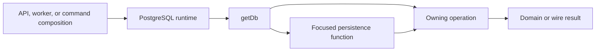

Core uses PostgreSQL for product and runtime state and an S3-compatible object store for captured and delivered media bytes. Application composition creates these infrastructure capabilities, then supplies narrow database or storage dependencies to the operation that owns each behavior.

<Note>
  A shared runtime does not create a shared persistence owner. Start with the named operation or query, then follow its focused read, write, or transaction and the central physical declaration.
</Note>

## PostgreSQL runtime

[`createPostgresRuntime`](https://github.com/coreyconner/snewse/blob/master/apps/core/src/infrastructure/postgres/database.ts) exposes two lazy capabilities:

- `getPool()` returns the process-scoped `pg` pool, creating it from `DATABASE_URL` on first use when no pool was injected.
- `getDb()` creates one Drizzle database over that pool and the complete Relations graph, then reuses it.

This design lets the API, worker, commands, and tests compose the same operation factories with an injected runtime. Importing a module does not open a connection. Most product code receives `getDb`; narrow infrastructure work such as readiness receives `getPool` when it needs the underlying client directly.

The central [`schema.ts`](https://github.com/coreyconner/snewse/blob/master/apps/core/src/infrastructure/postgres/schema.ts) exports physical tables from focused schema files. [`relations.ts`](https://github.com/coreyconner/snewse/blob/master/apps/core/src/infrastructure/postgres/relations.ts) defines the complete typed relation graph supplied to Drizzle. These files own database representation and navigation; public wire schemas remain in [`@snewse/contracts`](https://github.com/coreyconner/snewse/tree/master/packages/contracts/src).

## Reads, writes, and transaction ownership

An operation may use `getDb` directly when the database work is its focused implementation. A separate persistence function appears when the read or write has enough independent query, mapping, or coordination logic to name. In both forms, callers receive the named operation or query rather than a transaction callback, pool, query builder, or owner-wide persistence object.

Transactions belong to the behavior whose atomic outcome they protect. For example, [capture](/developer/core/ingestion/capture) owns canonical intake, [semantic publication](/developer/core/ingestion/semantics) owns finalization, and [User Access](/developer/core/user-access) owns grant acquisition. Those operations may collaborate through named capabilities, but they do not expose their transaction as a generic cross-owner service.

Typed Drizzle results provide persisted field types. Boundary validation remains appropriate for public requests, environment input, external provider data, historical structured payloads, and other untrusted provenance. An operation maps database projections to its domain or wire result instead of treating rows as public DTOs.

## Object storage

The [object-storage infrastructure](https://github.com/coreyconner/snewse/blob/master/apps/core/src/infrastructure/storage/object-storage.ts) parses one process configuration for an S3-compatible endpoint, credentials, region, and default bucket. If no endpoint or credentials are supplied, storage is absent. A partial configuration fails as invalid rather than silently behaving as unconfigured.

Storage exposes focused operations to ensure a bucket and fetch, put, or delete an object. Requests are signed at the infrastructure boundary. The object store holds bytes; PostgreSQL records the canonical Media identity, metadata, storage bucket, and object key used by product operations.

Storage participation depends on the use case:

- ingestion can prepare and upload captured Media before its database capture transaction, then clean up prepared objects if capture does not commit;
- Media delivery loads the authorized database record before fetching its stored object;
- readiness checks configured storage with a signed request and reports `not_configured` when the capability is absent.

See [Capture and submission](/developer/core/ingestion/capture) for the upload/commit boundary and [Media](/developer/core/media) for authorized delivery behavior.

## Process composition

The HTTP application creates one PostgreSQL runtime and threads `getDb` into Auth, Analytics, product owners, ingestion, and query coordinators. It supplies `getPool` only to database readiness. Object-storage configuration is resolved once and exposed through a provider to ingestion, Media, and readiness.

The manifest worker constructs its own runtime because it is a separate process. Its session closes the database pool and telemetry together during controlled shutdown. [Manifest worker execution](/developer/core/ingestion/worker) explains the worker's claim and publication lifecycle.

Migration commands, backup procedures, populated-database precautions, and isolated verification belong to the database operating guide. This page describes current runtime ownership and does not define an implementation standard or authorize a persistence exception.
