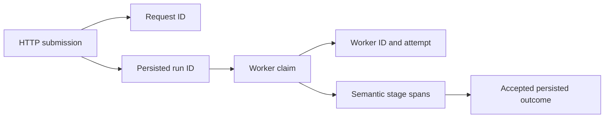

Operational telemetry explains whether Core processes and dependencies are working. It combines structured logs, OpenTelemetry metrics, and traces for the HTTP API, readiness checks, object storage, ingestion, model-provider calls, and manifest-worker execution. [Product analytics](/developer/core/analytics) records user-facing product behavior for a different purpose.

## Runtime lifecycle

The API entry point starts telemetry before it imports and constructs the HTTP application. The manifest worker starts the same runtime with its own service identity before it creates providers and worker operations. Each process shuts its telemetry runtime down as part of controlled exit, including failed startup or worker execution.

[`startCoreTelemetry`](https://github.com/coreyconner/snewse/blob/master/apps/core/src/infrastructure/observability/runtime.ts) configures OTLP traces and metrics, with log export enabled separately. Resource attributes include service name, the `snewse` namespace, deployment environment, and an optional instance ID. The API defaults to `snewse-core`; the worker uses `snewse-manifest-worker`.

<Info>
  Telemetry is fail-isolated. A disabled runtime returns a no-op shutdown. SDK startup failure disables export after a sanitized warning, and shutdown/export failure does not replace the product or worker outcome.
</Info>

The current environment schema and defaults live in [`core-env.ts`](https://github.com/coreyconner/snewse/blob/master/apps/core/src/infrastructure/runtime/core-env.ts). Collector setup and dashboard operation belong in operating guidance.

## HTTP correlation

The [request telemetry middleware](https://github.com/coreyconner/snewse/blob/master/apps/core/src/infrastructure/http/request-telemetry.ts) creates a server span around every request and propagates incoming W3C context. It puts the resolved request ID on Hono context so a downstream operation can attach the same identifier to its structured event.

For each completed request, Core emits:

| Signal | Useful dimensions |
| --- | --- |
| Structured log | Request ID, method, route template, status, duration, sanitized error type, and active trace/span IDs |
| Counter | Completed request count by method, route, status, and sanitized error type |
| Histogram | Request duration with the same bounded HTTP dimensions |
| Server span | Method, safe route, status, request ID, and error status for server failures |

Responses carry `X-Request-ID` and `Server-Timing`. When tracing is active, `Server-Timing` also exposes the active W3C `traceparent`, allowing browser telemetry to connect its work to the server span. [HTTP API behavior](/developer/core/http) explains response and route-sanitization behavior.

## Worker correlation

The manifest worker does not inherit an HTTP request span. Its persisted run ID, worker ID, attempt number, stage, status, and outcome form the useful correlation path.

Worker spans cover a run and its semantic stages. Structured events describe daemon start/stop, pass results, recovery, claims, and persisted outcomes. Provider spans attach bounded operation, model, attempt, latency, and input-count attributes. The worker's telemetry vocabulary is implemented in [`worker/telemetry.ts`](https://github.com/coreyconner/snewse/blob/master/apps/core/src/ingestion/worker/telemetry.ts), while provider instrumentation lives in [`provider-telemetry.ts`](https://github.com/coreyconner/snewse/blob/master/apps/core/src/ingestion/semantic/provider-telemetry.ts).

Use the persisted run as the source of truth for state. A log or span reports what an attempt observed; [worker fencing](/developer/core/ingestion/worker#the-lease-is-the-write-fence) decides whether that attempt was allowed to record a checkpoint, failure, or publication.

## Dependency and owner instrumentation

Infrastructure owns reusable mechanisms and dependency spans. Product owners name the behavior being observed:

- Health wraps overall readiness and delegates PostgreSQL and object-storage checks to their infrastructure owners.
- Object-storage fetch, put, delete, bucket, and readiness spans record bounded operation facts.
- Ingestion names capture, run, semantic-stage, and provider behavior.
- Analytics emits operational capture outcomes and counts without turning event payloads into telemetry.

The shared [`withTelemetrySpan`](https://github.com/coreyconner/snewse/blob/master/apps/core/src/infrastructure/observability/telemetry.ts) ends every span and converts thrown exceptions to a stable error type without exporting the original message or stack. The [default log sink](https://github.com/coreyconner/snewse/blob/master/apps/core/src/infrastructure/observability/logging.ts) retains an explicit attribute allowlist and catches console or exporter failures.

## Reading the signals

Start with the identifier that represents the work: request ID for one API exchange, or run ID plus worker ID and attempt for ingestion. Then use span status and the accepted persistence outcome to distinguish a failed dependency call from a run that actually changed state.

Read readiness as a current dependency probe, not a historical availability metric. Read HTTP `5xx` counts as server failures at the transport boundary, then follow the active trace to the owner span. Product event counts and accepted analytics batches answer behavior questions and should not be used as substitutes for request health.

The [observability standard](/standards/observability) owns tool choices and the operational telemetry boundary. [Observability](/developer/observability) connects browser, Core, and worker instrumentation. Use [local observability](/operate/observability) for Collector and dashboard setup.
