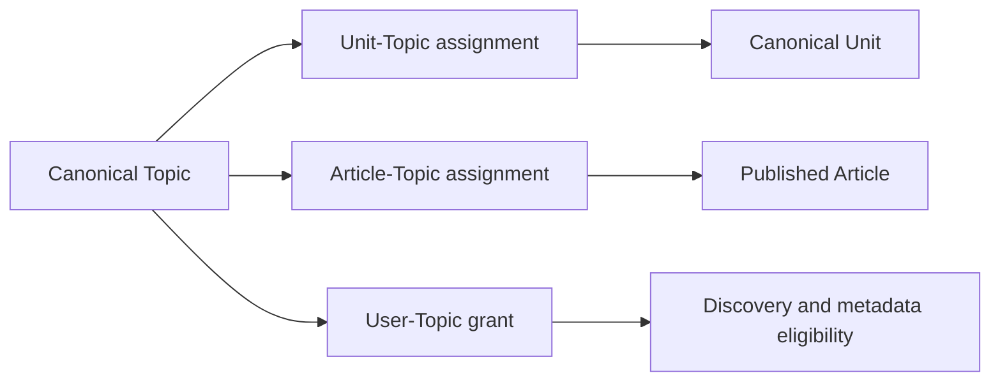

A Topic is a shared semantic identity for a person, institution, or place. Units and Articles can point to that identity, while User Access records which Topics a particular user can discover or inspect. The Topics owner keeps these three concerns separate: the canonical Topic, its content assignments, and the user's direct Topic grant.

<Note>
  A Topic assignment does not grant Topic access. Discovery and metadata require a direct Topic grant even when the user can access an assigned Article or Unit.
</Note>

## Identity and assignments

Every Topic has an internal ID, a unique lookup key, a display label, and a type. The key identifies the canonical record during semantic publication and exact metadata lookup. The [Topic schema](https://github.com/coreyconner/snewse/blob/master/apps/core/src/infrastructure/postgres/schema/topic.ts) and [public Topic contract](https://github.com/coreyconner/snewse/blob/master/packages/contracts/src/topics.ts) remain authoritative for storage constraints and exact wire shapes.

Two assignment relationships describe content, while a third relationship records user access:

| Relationship | Meaning |
| --- | --- |
| Unit–Topic | The canonical Unit was assigned that Topic during semantic processing. |
| Article–Topic | The published Article is associated with that Topic across its canonical Units. |
| User–Topic | The user has a materialized grant for standalone Topic discovery and metadata. |

Semantic publication reconciles an extracted key with the canonical Topic. An existing key keeps its identity, label, and type; a conflicting type fails publication instead of silently changing that identity. It then publishes Unit assignments and the Article-level Topic set as part of the derived content transaction. [Semantic processing and publication](/developer/core/ingestion/semantics) explains extraction, reconciliation, and assignment timing.

These assignments describe content. They do not determine who may discover a Topic, and Topic reads do not create or expand grants. [User Access](/developer/core/user-access) owns acquisition and grant propagation.

## Direct access and per-user counts

Discovery starts from the caller's direct Topic grants. Core then calculates the two counts independently for that caller:

- `articleCount` includes assigned Articles for which the caller has a direct Article grant.
- `unitCount` includes assigned Units for which the caller has a direct Unit grant.

The independent calculations avoid multiplying one count when a Topic has many assignments of both kinds. They also make the result personal: two users can discover the same canonical Topic with different counts.

A direct Topic grant remains eligible when both counts are zero. A Topic backed only by accessible Units is also eligible with an Article count of zero. These states are useful distinctions because Topic access and content access are materialized separately.

The [accessible Topic read](https://github.com/coreyconner/snewse/blob/master/apps/core/src/topics/persistence/read-accessible-topics.ts) establishes the eligible set, and the [count expressions](https://github.com/coreyconner/snewse/blob/master/apps/core/src/topics/persistence/accessible-topic-counts.ts) define the per-user intersections.

## Discovery order and continuation

Topic search is literal and case-insensitive after Core trims the query, collapses internal whitespace, and lowercases it. Characters such as `%` and `_` have no wildcard meaning. Matching Topics fall into ordered relevance tiers:

| Precedence | Match |
| --- | --- |
| First | Label exactly equals the query |
| Second | Label begins with the query |
| Third | Label contains the query |
| Fourth | Key begins with the query |
| Fifth | Key contains the query |

Within one tier, Core orders larger accessible Article counts first, then larger accessible Unit counts, followed by label and key in ascending order. With no search text, every accessible Topic shares the first tier and the same count-and-name ordering applies.

A continuation cursor binds the normalized query and the complete sort position of the last item. Each page recomputes current eligibility and counts before applying that continuation. A changed grant can therefore change a later page; the cursor does not freeze an earlier snapshot of the user's accessible corpus.

[`rankTopic` and `compareTopics`](https://github.com/coreyconner/snewse/blob/master/apps/core/src/topics/topic-order.ts) define the ordering. The [cursor adapter](https://github.com/coreyconner/snewse/blob/master/apps/core/src/topics/http/topic-cursor.ts) and [Topic routes](https://github.com/coreyconner/snewse/blob/master/apps/core/src/topics/http/create-topic-routes.ts) define the exact request and continuation mechanics.

## Metadata and content boundaries

Topic metadata performs an exact key lookup inside the caller's accessible Topic set. It returns the canonical reference and the caller's current accessible Article and Unit counts. Unknown keys and Topics outside the caller's direct grants share the same private not-found result.

Metadata does not contain an Article stream. Filtering Articles by Topic is a separate Article-query concern: the query begins with the caller's accessible Articles and then applies the exact Topic assignment. Consequently, a Topic can appear in discovery with accessible Units while an Article stream for that Topic is empty. The [Article Topic filter](https://github.com/coreyconner/snewse/blob/master/apps/core/src/queries/articles/filters/topics.ts) shows that separate intersection.

Topic references also participate in trusted composition:

- [Articles](/developer/core/articles) loads the Article's direct Topic assignments in key order after authorizing the Article aggregate.
- [Units and Grafs](/developer/core/units) returns a Unit's Topic assignments after authorizing the standalone Unit.

Those references describe the authorized parent content. They do not make the parent request depend on a separate Topic grant. A standalone discovery or metadata request still uses direct Topic access.

<Columns cols={3}>
  <Card title="User Access" icon="key-round" href="/developer/core/user-access">
    Follow Topic grant acquisition and propagation.
  </Card>
  <Card title="Semantic processing" icon="wand-sparkles" href="/developer/core/ingestion/semantics">
    See how canonical Topics and assignments are published.
  </Card>
  <Card title="Media" icon="image" href="/developer/core/media">
    Continue with Core's other canonical child resource.
  </Card>
</Columns>
