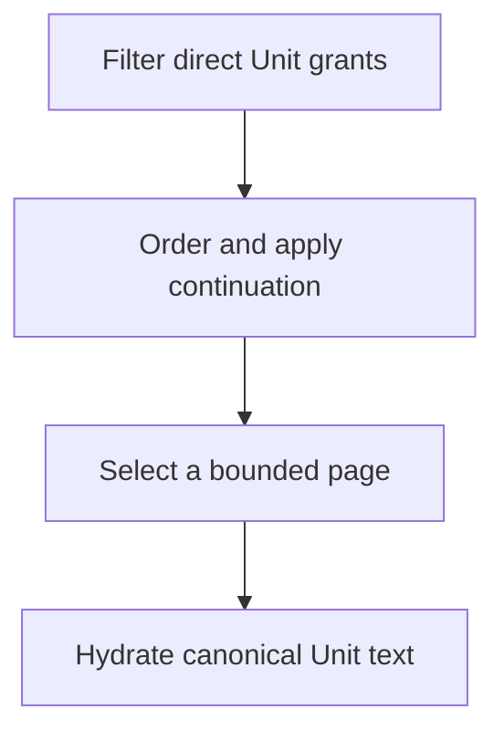

Unit queries produce bounded lists from the Units granted directly to an authenticated user. A Unit's originating Article supplies limited context for the result, but Article access is neither required nor inferred. The query begins with Unit grants, applies an optional exact Topic filter, ranks the eligible Units, and reconstructs canonical Unit text only for the returned page.

<Note>
  Unit queries have their own persistence and continuation path. Their behavior should not be inferred from Article queries, especially around filters, vector ranking, and text hydration.
</Note>

## How a Unit page is selected

Core performs source validation, candidate selection, Graf loading, and exhaustion detection in one read-only, repeatable-read transaction. It selects one candidate beyond the requested count to determine whether another page exists. Only the returned Units contribute Graf IDs to the hydration query.

The current [`readUnitPage`](https://github.com/coreyconner/snewse/blob/master/apps/core/src/queries/units/persistence/read-unit-page.ts) implementation owns this database boundary. The [Unit query contract](https://github.com/coreyconner/snewse/blob/master/packages/contracts/src/units.ts) is authoritative for accepted parameters, limits, defaults, and exact response fields.

## Unit-specific eligibility

The base eligible set comes from the authenticated user's direct Unit grants. [User Access](/developer/core/user-access) explains how Article acquisition and semantic finalization materialize those grants. The query does not substitute access to an originating Article, and the Article context returned with a Unit does not prove Article access.

When a Topic key is present, Core retains only Units with an exact Unit-to-Topic assignment for that key. This is independent from Article-level Topic assignments. A well-formed key with no eligible Units returns an empty page. [`unitTopicEligibility`](https://github.com/coreyconner/snewse/blob/master/apps/core/src/queries/units/filters/topics.ts) defines the current filter.

Unlike the Article family, Unit queries do not accept Collection or Tag filters. This boundary follows the current Unit relationships rather than trying to force both query families into one generic filter model.

## Ordering and related ranking

Unit queries support grant time, Unit publication time, and semantic relatedness. Grant-time ordering descends from the timestamp on the direct Unit grant. Publication ordering puts dated Units before Units without a publication time. Unit ID is the final ascending tie-breaker for both.

For related ordering, Core separately verifies direct access to the source Unit and reads its embedding. The source need not match the requested Topic filter. Core excludes only that source Unit, ranks the complete filtered eligible set by ascending cosine distance, and uses Unit ID to break ties. This leaves other eligible Units from the same Article in the result.

An accessible source without a usable vector returns an empty related page. Candidates without a usable comparison are omitted only from related results. The Unit ranking path uses the indexed half-precision Unit expression while preserving full eligible-set ordering outside the candidate subquery. The current [`relatedUnitDistance`](https://github.com/coreyconner/snewse/blob/master/apps/core/src/queries/units/rankings/related.ts) implementation and [`readEligibleUnitRows`](https://github.com/coreyconner/snewse/blob/master/apps/core/src/queries/units/persistence/read-unit-page.ts) remain authoritative for that storage detail.

## Continuation rechecks access

The next cursor records the complete ordering position and binds the selected order, exact Topic key, and related source when present. It is opaque to clients. Reusing it with a different query identity fails validation, while changing the page size is allowed.

Every page rebuilds the eligible Unit set from current grants and Topic assignments. The cursor is therefore continuation data, not authorization or a frozen result snapshot. It can continue after the former boundary row is deleted, and later pages reflect access or membership changes that occurred since the prior request.

Core preserves complete timestamp and distance precision in the cursor and uses Unit ID as the stable secondary position. [`unit-cursor.ts`](https://github.com/coreyconner/snewse/blob/master/apps/core/src/queries/units/unit-cursor.ts) defines its versioned shape and compatibility checks.

## Canonical text hydration

Each selected Unit carries an ordered list of Graf references. Core validates that list, loads the distinct referenced Grafs for returned rows, and walks each Unit's stored order to reconstruct its text. Every Graf passes through the same canonical text transformation used by standalone Unit and Article composition, and adjacent Graf values are separated at the Unit boundary.

Missing or malformed Graf references are stored-data failures. The query fails rather than dropping a Graf or returning partial Unit text. The response also includes the Unit's role and publication time, its grant time, and minimum originating Article context. It does not expand that context into an Article summary or disclose vectors and ranking distances.

See [Units and Grafs](/developer/core/units) for canonical text and composition semantics. [`queryUnits`](https://github.com/coreyconner/snewse/blob/master/apps/core/src/queries/units/query-units.ts) assembles the public result, and the [integration tests](https://github.com/coreyconner/snewse/blob/master/apps/core/src/queries/units/__tests__/query-units.integration.test.ts) verify paging, live eligibility, full-set related ranking, and returned-row-only Graf hydration.

<Columns cols={3}>
  <Card title="Units and Grafs" icon="blocks" href="/developer/core/units">
    Understand canonical Unit text and standalone composition.
  </Card>
  <Card title="User Access" icon="key-round" href="/developer/core/user-access">
    Follow independent Unit grants and propagation.
  </Card>
  <Card title="Article queries" icon="newspaper" href="/developer/core/article-queries">
    Compare Article filters and summary hydration.
  </Card>
</Columns>
