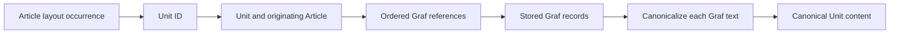

A Unit is a canonical content resource derived from one originating Article. It groups an ordered set of Grafs, can carry its own role, publication time, and Topics, and can be granted independently. A Graf is the addressable text element within that Unit.

The Units owner controls Unit-to-Graf composition and canonical Graf text. The Articles owner controls where Unit occurrences appear in an Article layout. This lets the same Unit content support a complete Article aggregate and an independently authorized Unit view without creating two definitions of its text.

<Note>
  A Unit's identity is independent of its placement. An Article layout may reference one Unit more than once; each occurrence resolves to the same canonical Unit content.
</Note>

## Unit and Graf composition

Each Unit records one originating Article ID and a nonempty `graf_refs` list. The references must be unique within the Unit, and their stored order is the only Graf order for that Unit. Core validates the JSON value before using it, loads the referenced Graf records, and maps them back through `graf_refs` rather than relying on database row order.

The [Unit and Graf schema](https://github.com/coreyconner/snewse/blob/master/apps/core/src/infrastructure/postgres/schema/unit.ts) defines persistence. The [Unit contract](https://github.com/coreyconner/snewse/blob/master/packages/contracts/src/units.ts) defines the exact public shapes. The contract exposes Graf IDs and canonical `text`; storage-specific fields remain in the source model.

## Canonical Graf text

Core derives public Graf text from stored plain text at the Unit boundary. It normalizes inline quote markup into display quotation marks, removes loose quote tags, and trims only the outside of the result. Internal whitespace stays intact. A whitespace-only source can therefore produce an empty canonical string while the Graf and its position remain present. [`canonicalizeGrafText`](https://github.com/coreyconner/snewse/blob/master/apps/core/src/units/operations/canonicalize-graf-text.ts) remains the authority for the exact transformation.

The same canonicalizer is used when Article composition loads Units, when Unit query results derive Unit text, and when semantic processing derives a Unit's combined text. This keeps the Graf text definition consistent across Article composition, Unit views, queries, and semantic processing.

<Note>
  Stored Graf plain text and public canonical Graf text serve different purposes. Consumers should use the `text` returned by Core for display and text coordinates; exact storage fields and hashes remain implementation evidence.
</Note>

## Two composition paths

[`loadArticleUnits`](https://github.com/coreyconner/snewse/blob/master/apps/core/src/units/operations/load-article-units.ts) is the trusted content operation. It accepts an Article ID and an ordered list of Unit IDs, then:

- preserves the caller's Unit order
- verifies that every requested Unit exists
- verifies that every Unit originated from the supplied Article
- preserves each Unit's `graf_refs` order
- rejects a missing Graf instead of dropping it
- returns each Graf with canonical text

The Articles owner uses this operation after it authorizes the parent Article. The loader performs no user authorization of its own because its inputs come from the trusted Article layout. See [Articles](/developer/core/articles) for placement and aggregate assembly.

[`composeUnit`](https://github.com/coreyconner/snewse/blob/master/apps/core/src/units/operations/compose-unit.ts) serves a standalone Unit. It first reads the caller's direct Unit grant, the Unit's canonical Topic assignments, and minimal context for the originating Article. It then delegates content assembly to the same trusted loader. The result contains:

- canonical Unit content and Topics
- the originating Article's ID, slug, and headline as context
- the timestamp of the caller's Unit grant

The Article context identifies the origin of the Unit. It does not acquire or prove access to that Article, expose sibling Units, or expand the standalone Unit grant. [User Access](/developer/core/user-access) is authoritative for those grant relationships.

## Integrity and request failures

The [Unit HTTP adapter](https://github.com/coreyconner/snewse/blob/master/apps/core/src/units/http/create-unit-routes.ts) owns session, request-validation, and private-cache mechanics. Unknown and inaccessible Units use the same private not-found response, so the route does not reveal whether another user has a particular Unit.

Corrupt canonical references cross a different boundary. Invalid `graf_refs`, a missing requested Unit, an originating-Article mismatch, or a missing Graf causes a server error. These conditions represent broken stored composition, so the operation does not convert them into access denial or incomplete content.

Core has no public Graf endpoint. Public Grafs travel as ordered content within a Unit, whether that Unit is embedded in Article detail or returned by standalone Unit composition.

The focused [Graf reference tests](https://github.com/coreyconner/snewse/blob/master/apps/core/src/units/__tests__/graf-refs.test.ts), [canonicalization tests](https://github.com/coreyconner/snewse/blob/master/apps/core/src/units/__tests__/canonicalize-graf-text.test.ts), and [Unit loading tests](https://github.com/coreyconner/snewse/blob/master/apps/core/src/units/__tests__/load-article-units.test.ts) specify the ordering and failure behavior.

<Columns cols={3}>
  <Card title="Articles" icon="newspaper" href="/developer/core/articles">
    See how Article layout places canonical Unit content.
  </Card>
  <Card title="User Access" icon="key-round" href="/developer/core/user-access">
    Follow standalone and derived Unit grants.
  </Card>
  <Card title="Core architecture" icon="network" href="/developer/core/overview">
    See the ownership and composition model.
  </Card>
</Columns>
