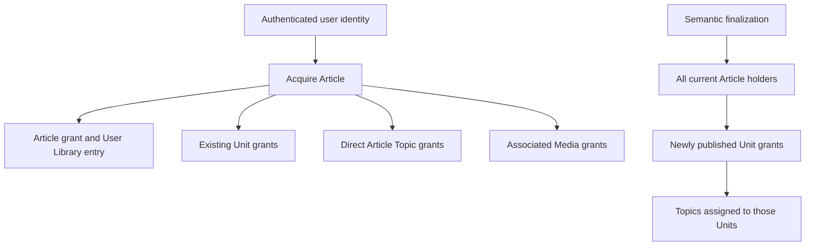

User Access records which shared resources an authenticated user can access. Authentication supplies the user identity to an operation; it does not grant access to an Article, Unit, Topic, or Media item by itself.

Core stores a separate relationship for each resource type. These relationships are the authorization facts used by content operations. Private ownership of a Collection or annotation is a different relationship with different behavior.

<Note>
  The current runtime does not expose a general-purpose endpoint for creating grants. Manifest intake supplies an authenticated user ID to the Article acquisition operation after capture succeeds. See the current [`submit-manifest-bundle` operation](https://github.com/coreyconner/snewse/blob/master/apps/core/src/ingestion/operations/submit-manifest-bundle.ts) for that composition.
</Note>

## Materialized grants

| Relationship | What it authorizes | Time retained |
| --- | --- | --- |
| User to Article | Exact Article access and inclusion in the User Library | `addedAt`, set on first acquisition |
| User to Unit | Exact Unit access | `grantedAt`, set when the Unit grant is first created |
| User to Topic | Topic discovery and metadata access | No public grant time |
| User to Media | Exact Media metadata, transcript, and content access | `grantedAt`, set when the Media grant is first created |

The relationships are independent at read time. An Article relationship is not evaluated as a substitute for a missing Unit or Media relationship. A Unit relationship does not authorize its originating Article or sibling Units.

## Article acquisition and propagation

Article acquisition is idempotent. The operation locks the Article, creates the user-to-Article relationship when needed, and retains the original `addedAt` value on repeat acquisition. Within the same transaction, it materializes access to resources that already belong to the Article:

- every existing Unit whose origin is that Article;
- every Topic assigned directly to that Article; and
- every Media item associated with that Article.

The operation can run while an Article is still processing. In that case it grants access to captured Media that already exists. Semantic finalization later grants newly published Units to every Article holder and grants the Topics assigned to those Units. A repeat Article acquisition also fills in Unit, Topic, or Media relationships that became available after the first acquisition.

The Article lock coordinates acquisition with semantic finalization so either commit order produces the same effective access. Each transaction inserts missing relationships without replacing existing grant timestamps.

Core also contains an internal direct Unit acquisition operation. It would grant one Unit and that Unit's Topics without granting the originating Article, sibling Units, or Media. The operation is currently not connected to a production entry point; its source explicitly reserves it for a separately approved trusted acquisition workflow. See [`grant-direct-unit-access.ts`](https://github.com/coreyconner/snewse/blob/master/apps/core/src/user-access/operations/grant-direct-unit-access.ts).

## Independent reads and trusted composition

The place where Core checks a grant depends on the shape of the operation.

| Operation shape | Access decision | What happens after the decision |
| --- | --- | --- |
| Exact Article composition | Checks the exact Article relationship once | [Articles](/developer/core/articles) loads that Article's canonical Units, Topics, and Media through trusted owner operations |
| Exact Unit composition | Starts from the exact Unit relationship and its grant time | [Units and Grafs](/developer/core/units) loads the Unit's canonical content and limited Article context; this does not grant Article access |
| Media metadata, transcript, or bytes | Checks the exact Media relationship before loading or delivering content | An associated or accessible Article is not a fallback authorization path |
| Topic discovery or metadata | Starts from materialized Topic relationships for the user | Accessible Article and Unit relationships constrain the counts returned for each Topic |
| Article or Unit query | Builds an eligible set from the corresponding access table | Filters, ranking, and pagination operate inside that eligible set |

Trusted loading is narrow composition inside an already-authorized owner operation. For example, the Article Composer checks Article access and then loads only the Unit, Topic, and Media resources referenced by that Article. If a client later follows a Media content URL as a standalone request, Media performs its own direct access check.

The current implementations make these boundaries visible in [`compose-article.ts`](https://github.com/coreyconner/snewse/blob/master/apps/core/src/articles/operations/compose-article.ts), [`read-accessible-unit-context.ts`](https://github.com/coreyconner/snewse/blob/master/apps/core/src/units/persistence/read-accessible-unit-context.ts), [`get-topic-metadata.ts`](https://github.com/coreyconner/snewse/blob/master/apps/core/src/topics/operations/get-topic-metadata.ts), and [`can-access-media.ts`](https://github.com/coreyconner/snewse/blob/master/apps/core/src/user-access/operations/can-access-media.ts).

## The User Library is a projection

The User Library is the set of Articles in the user's Article access relationships. It has no separate membership record. Article queries begin with those relationships, and the stored `addedAt` value supplies the default acquisition ordering.

[Collections](/developer/core/collections) can narrow that accessible set by membership, but placing an Article in a Collection does not create an Article grant. Removing membership or deleting a Collection does not revoke one. This separation keeps organization from becoming a second authorization model.

## Ownership boundaries

User Access owns grant acquisition, materialization, and direct access decisions. Resource owners remain responsible for composing their own responses after authorization. The [Core architecture](/developer/core/overview) explains how those operations are assembled.

The current database relationships are defined in [`schema/user-access.ts`](https://github.com/coreyconner/snewse/blob/master/apps/core/src/infrastructure/postgres/schema/user-access.ts). Semantic publication's grant propagation is implemented in [`finalization.ts`](https://github.com/coreyconner/snewse/blob/master/apps/core/src/ingestion/worker/persistence/finalization.ts).
