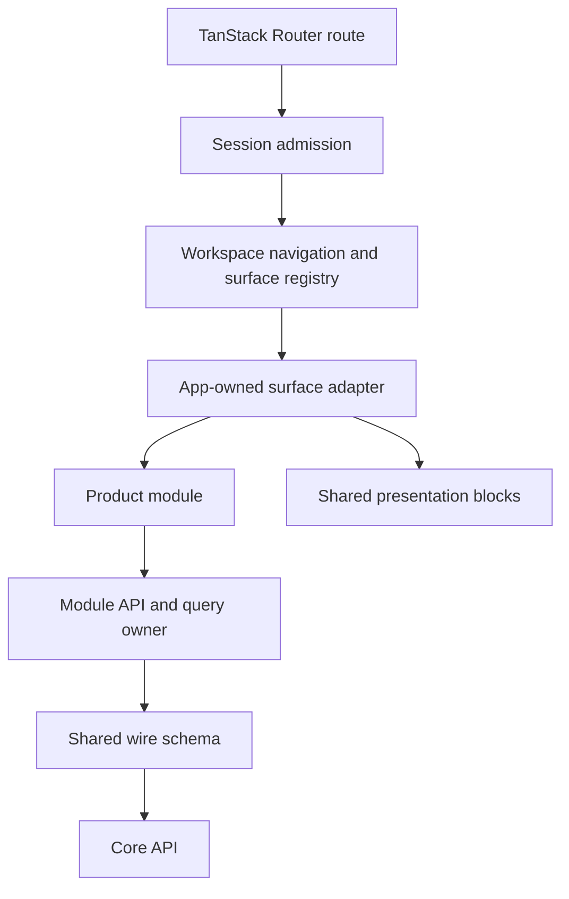

Devour is the browser application for finding, opening, and working with SNEWSE content. It owns the authenticated workspace, route-backed pane composition, Article and context surfaces, direct sign-in, and the browser clients that consume Core APIs. Core remains the authority for canonical content, access, and persisted user data.

The application keeps product behavior in focused modules and combines those modules at app-owned seams. A module can describe a neutral action such as opening an Article or Topic. The workspace adapter decides where that action appears, which pane it affects, and how the browser URL changes.

## Application composition

The [root route](https://github.com/coreyconner/snewse/blob/master/apps/devour/src/routes/__root.tsx) provides one TanStack Query client for the application and installs the document shell, global error boundary, and browser-only support UI. The [router](https://github.com/coreyconner/snewse/blob/master/apps/devour/src/router.tsx) puts that query client in route context and enables Router scroll restoration.

The canonical [workspace route](https://github.com/coreyconner/snewse/blob/master/apps/devour/src/routes/workspace.tsx) then composes the workspace-specific runtime:

1. `WorkspaceAccessBoundary` admits a verified user.
2. The Wayfinder and annotation providers establish user-scoped interaction state.
3. `WorkspaceNavigationProvider` translates product navigation into URL transactions.
4. `WorkspaceViewport` renders the navigation rail and pane layout.
5. `WorkspaceCommandPaletteBridge` and `WayfinderStatusControl` connect root-level controls to the workspace.

This nesting gives each lifetime a clear owner. The root query client spans routes. Session admission guards the private workspace. Workspace providers exist only after admission. Individual surfaces mount and unmount with their pane descriptors.

See [Workspace navigation](/developer/devour/workspace-navigation) for the URL lifecycle and [Sessions, data, and state](/developer/devour/state) for session and cache ownership.

## Four implementation layers

| Layer | Responsibility | Current owners |
| --- | --- | --- |
| Routes and app shell | Bootstrap the app, admit the user, own workspace placement, and translate navigation between products | [`routes/`](https://github.com/coreyconner/snewse/tree/master/apps/devour/src/routes), [`app/workspace/`](https://github.com/coreyconner/snewse/tree/master/apps/devour/src/app/workspace), and [`app/shell/`](https://github.com/coreyconner/snewse/tree/master/apps/devour/src/app/shell) |
| Product modules | Own domain data, view state, product actions, and placement-neutral surfaces | [`modules/`](https://github.com/coreyconner/snewse/tree/master/apps/devour/src/modules) |
| Shared blocks and primitives | Render display-ready content and controls without fetching product data or choosing workspace placement | [`components/blocks/`](https://github.com/coreyconner/snewse/tree/master/apps/devour/src/components/blocks) and [`components/ui/`](https://github.com/coreyconner/snewse/tree/master/apps/devour/src/components/ui) |
| Shared packages and Core | Define wire contracts and browser query defaults, then authorize and serve canonical resources | [`packages/contracts`](https://github.com/coreyconner/snewse/tree/master/packages/contracts/src), [`packages/browser-client`](https://github.com/coreyconner/snewse/tree/master/packages/browser-client/src), and [Core architecture](/developer/core/overview) |

The shared-block boundary is deliberately narrow. Blocks accept display-ready values and callbacks. A product module adapts API data into those values, and an app adapter turns callbacks into workspace operations. The current architecture checks these directions in the [component ownership test](https://github.com/coreyconner/snewse/blob/master/apps/devour/src/components/__tests__/componentsOwnershipBoundary.test.ts) and [app ownership test](https://github.com/coreyconner/snewse/blob/master/apps/devour/src/app/__tests__/appOwnershipBoundary.test.ts).

## Surface registration

A workspace pane stores a stable pane ID, a `surfaceKind`, and surface-owned route state. The [surface registry](https://github.com/coreyconner/snewse/blob/master/apps/devour/src/app/workspace/workspaceSurfaceRegistry.ts) connects each kind to two things: a parser for its route state and a renderer supplied by the app.

The [surface assembly](https://github.com/coreyconner/snewse/blob/master/apps/devour/src/app/workspace/workspaceSurfaceAssembly.tsx) is the one place that registers the shipped workspace surfaces. It currently assembles the User Library, Topics Explore, Article, Unit Details, related Articles, Topic, annotations, and Wayfinder result surfaces. This registry validates descriptors before navigation and resolves them when the pane host renders the ordered workspace.

Surface registrations do not move domain ownership into the app layer. For example, the Article module owns Article loading and rendering. `ArticleWorkspaceAdapter` supplies pane chrome, connects neutral Article requests to workspace navigation, and coordinates annotations and Wayfinder through the module's public interfaces.

## Capability exchange between mounted surfaces

Some interactions need a live mounted Article rather than durable route data. The [Article capability provider](https://github.com/coreyconner/snewse/blob/master/apps/devour/src/app/workspace/ArticleSurfaceCapabilities.tsx) keeps an ephemeral registry keyed by pane ID. A mounted Article adapter publishes its public Article capability together with its annotation integration. A context surface can then address the exact Article pane that created it.

This runtime registry is separate from workspace state:

- it exists only while a matching Article surface is mounted;
- it does not serialize functions or loaded content into the URL;
- it exposes public capabilities instead of module-private implementation;
- it removes a registration when the owning adapter unmounts.

The [Article workspace adapter](https://github.com/coreyconner/snewse/blob/master/apps/devour/src/app/workspace/surfaces/ArticleWorkspaceAdapter.tsx) is the main composition seam. It opens Topic, Unit Details, related-Article, and annotation contexts; publishes the mounted Article capability; and gives Wayfinder a normalized Article context. Detailed Article rendering remains with the [Article module](https://github.com/coreyconner/snewse/tree/master/apps/devour/src/modules/article), while placement remains with the workspace.

## Find a surface owner

| Product area | Module | Workspace composition |
| --- | --- | --- |
| User Library and Collections | [User Library module](https://github.com/coreyconner/snewse/tree/master/apps/devour/src/modules/reader-library) | [User Library adapter](https://github.com/coreyconner/snewse/blob/master/apps/devour/src/app/workspace/surfaces/ReaderLibraryWorkspaceAdapter.tsx) |
| Article view | [`modules/article`](https://github.com/coreyconner/snewse/tree/master/apps/devour/src/modules/article) | [`ArticleWorkspaceAdapter.tsx`](https://github.com/coreyconner/snewse/blob/master/apps/devour/src/app/workspace/surfaces/ArticleWorkspaceAdapter.tsx) |
| Topics | [`modules/topics`](https://github.com/coreyconner/snewse/tree/master/apps/devour/src/modules/topics) | [Topics adapters](https://github.com/coreyconner/snewse/tree/master/apps/devour/src/app/workspace/surfaces) |
| Unit Details and related content | [`modules/unit`](https://github.com/coreyconner/snewse/tree/master/apps/devour/src/modules/unit) and [`modules/related-content`](https://github.com/coreyconner/snewse/tree/master/apps/devour/src/modules/related-content) | [`UnitDetailsWorkspaceAdapter.tsx`](https://github.com/coreyconner/snewse/blob/master/apps/devour/src/app/workspace/surfaces/UnitDetailsWorkspaceAdapter.tsx) and related-content adapters |
| Annotations | [Annotations module](https://github.com/coreyconner/snewse/tree/master/apps/devour/src/modules/reader-annotations) | [Annotations adapter](https://github.com/coreyconner/snewse/blob/master/apps/devour/src/app/workspace/surfaces/ReaderAnnotationsWorkspaceAdapter.tsx) and the Article adapter |
| Command Palette and Wayfinder presentation | [`modules/command-palette`](https://github.com/coreyconner/snewse/tree/master/apps/devour/src/modules/command-palette) and [`modules/wayfinder`](https://github.com/coreyconner/snewse/tree/master/apps/devour/src/modules/wayfinder) | [`WorkspaceCommandPaletteBridge.tsx`](https://github.com/coreyconner/snewse/blob/master/apps/devour/src/app/workspace/WorkspaceCommandPaletteBridge.tsx) and Wayfinder workspace adapters |

<Columns cols={2}>
  <Card title="Workspace navigation" icon="route" href="/developer/devour/workspace-navigation">
    Follow route entry, serialization, pane transactions, and browser history.
  </Card>
  <Card title="Sessions, data, and state" icon="database" href="/developer/devour/state">
    See where session, server data, preferences, forms, and transient interaction state belong.
  </Card>
</Columns>
