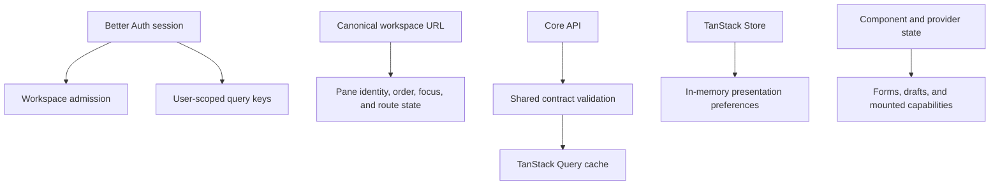

Devour uses several state mechanisms because they have different lifetimes and authorities. The URL owns durable workspace composition. TanStack Query owns server data. Better Auth owns the browser session. Forms and feature providers own active interactions. TanStack Store holds small, non-durable presentation preferences.

## Choose the state owner

| State | Owner | Examples |
| --- | --- | --- |
| Must survive reload, copying, and browser history | TanStack Router and the workspace URL | Pane descriptors, order, focus, Article ID, selected Collection, selected Topic |
| Comes from or is written to Core | TanStack Query plus a module API owner | Article detail, Article lists, Topics, Collections, Units, saved annotations |
| Describes the current authenticated browser user | Better Auth through `authClient.useSession()` | Admission, query enablement, and the user ID in private cache keys |
| Shared presentation state that does not belong in the URL | A narrow TanStack Store owner | Navigation rail expansion, Article-card layout |
| Belongs to an active interaction or mounted instance | Component state or a focused provider | Sign-in fields, unsaved annotation drafts, mounted Article capabilities, per-surface Article Topic filters |

The decision is based on authority and lifetime rather than which framework is convenient. [Workspace navigation](/developer/devour/workspace-navigation) describes the durable URL value. The [app store](https://github.com/coreyconner/snewse/blob/master/apps/devour/src/app/state/appStore.ts) contains no pane state or selected product resource.

Current TanStack Store preferences are memory-only. Reloading Devour recreates their defaults. The only durable workspace representation is the Router search value.

## Session admission

The [Better Auth client](https://github.com/coreyconner/snewse/blob/master/apps/devour/src/lib/authClient.ts) is Devour's reactive session source. Devour does not wrap it in a separate auth provider. The client rechecks the session on window focus and does not recheck while offline.

The [workspace admission boundary](https://github.com/coreyconner/snewse/blob/master/apps/devour/src/app/workspace/WorkspaceAccessBoundary.tsx) handles four outcomes before product surfaces mount:

<Tabs sync={false}>
  <Tab title="Pending">
    Devour renders a blank, busy application surface while the session check is unresolved. Private workspace providers and product surfaces are not mounted yet.
  </Tab>
  <Tab title="Failed check">
    Devour fails closed and presents a retry action. A transport failure is not interpreted as a signed-out session.
  </Tab>
  <Tab title="Signed out">
    Devour replace-navigates to `/sign-in` with a normalized return path. The workspace remains unmounted.
  </Tab>
  <Tab title="Signed in">
    Devour mounts the user-scoped providers, navigation runtime, and workspace surfaces.
  </Tab>
</Tabs>

The current [`/sign-in` route](https://github.com/coreyconner/snewse/blob/master/apps/devour/src/routes/sign-in.tsx) supports direct email/password sign-in in Devour. A successful submission refreshes the native session before replace-navigation to the safe return path. Account links handle signup and password recovery. Core's authentication runtime still owns credentials, session policy, and server authorization.

<Note>
  A valid session identifies the user. It does not grant access to an Article, Unit, Topic, or Media item. Core applies the materialized resource grants described in [User Access](/developer/core/user-access).
</Note>

## Query client and cache lifetimes

The root route receives one browser Query client from [`startQueryClient.ts`](https://github.com/coreyconner/snewse/blob/master/apps/devour/src/lib/startQueryClient.ts). The [Browser Client package](/developer/packages#browser-client) supplies the shared query behavior; its [`queryClient.ts`](https://github.com/coreyconner/snewse/blob/master/packages/browser-client/src/queryClient.ts) remains the authority for exact stale times, garbage-collection windows, reconnection behavior, and retry limits.

The shared defaults distinguish published content from mutable data:

- published data can remain fresh longer and stay cached longer;
- mutable data uses shorter fresh and cache windows;
- mutations do not retry automatically;
- the default query policy bounds retries to transient conditions and does not retry an aborted request.

Module query owners can narrow those defaults. Article streams, Collections, Topics, and saved annotations currently disable automatic query retry and expose deliberate retry behavior in their surfaces. Exact Article and Unit detail use the published-data profile.

These timing constants are cache policy, not data authority. A surface still parses every successful response and treats access failures according to that query's behavior.

## User-scoped private data

Private query keys include the current user ID as well as the resource and normalized request inputs. For example:

- exact Article detail keys include user ID and Article ID;
- Article-list keys include user ID, filters, order, source, and page size;
- Topic and Collection keys include user ID and their normalized selection;
- annotation keys include user ID and Article ID.

Queries remain disabled until both the session identity and required resource identifiers are valid. When identity or inputs change, the new key prevents late results from becoming the active view for the new request.

Saved annotation data has an additional identity transition boundary. The [annotation provider](https://github.com/coreyconner/snewse/blob/master/apps/devour/src/modules/reader-annotations/ReaderAnnotationsProvider.tsx) cancels and removes the departed user's saved annotation queries before the next identity is displayed. Its [draft provider](https://github.com/coreyconner/snewse/blob/master/apps/devour/src/modules/reader-annotations/readerAnnotationDrafts.tsx) separately resets in-memory drafts when their owner changes.

<Warning>
  Including a user ID in a cache key prevents browser-cache collisions; it is not an authorization check. API operations must still enforce the current session and resource access on every request.
</Warning>

## API and contract boundary

Each product module owns the HTTP calls and query options for its use case. Shared contracts in [`@snewse/contracts`](https://github.com/coreyconner/snewse/tree/master/packages/contracts/src) define the wire schemas. The module parses incoming JSON before the result enters its query cache, and mutation owners also validate structured request bodies before sending them.

The [Article API owner](https://github.com/coreyconner/snewse/blob/master/apps/devour/src/modules/article/data/articleApi.ts), [Article query owner](https://github.com/coreyconner/snewse/blob/master/apps/devour/src/modules/article-query/articleQueryApi.ts), and [annotations API owner](https://github.com/coreyconner/snewse/blob/master/apps/devour/src/modules/reader-annotations/readerAnnotationsApi.ts) show the pattern:

1. normalize route or request identifiers;
2. issue a same-origin credentialed request;
3. translate a failed response into a bounded API error;
4. parse successful JSON with the shared response schema;
5. cache only the validated result.

The shared [query error adapter](https://github.com/coreyconner/snewse/blob/master/packages/browser-client/src/queryErrors.ts) retains HTTP status and the server's `x-request-id` when present. Contract-validation details are converted to a safe feature-level fallback instead of being displayed as raw schema diagnostics.

Wire types are distinct from UI models. Product modules can derive display-ready values for shared blocks, but those view models do not replace the public contract or become a second API schema. [Devour architecture](/developer/devour/overview) describes that module-to-block boundary.

## Local and transient interaction state

State stays local when it only coordinates the mounted interaction:

- TanStack Form owns sign-in values, validation metadata, and the awaited submission lifecycle.
- The annotation draft provider owns active and parked unsaved drafts in memory and warns before unloading dirty work.
- The Topics module's [`useArticleTopicFilters`](https://github.com/coreyconner/snewse/blob/master/apps/devour/src/modules/topics/useArticleTopicFilters.ts) hook owns Article Topic filter state per mounted surface, so each Article and Unit Details instance keeps an independent selection.
- The Article capability provider owns callable capabilities for mounted Article panes.

None of these values is serialized into the workspace URL or written to the server merely because multiple components use it. Persisted annotations move through their mutation and query owners; durable pane selections move through workspace navigation.

<Columns cols={2}>
  <Card title="Devour architecture" icon="network" href="/developer/devour/overview">
    Trace state through routes, adapters, product modules, and shared packages.
  </Card>
  <Card title="Workspace navigation" icon="route" href="/developer/devour/workspace-navigation">
    See how durable pane state is validated and synchronized with browser history.
  </Card>
</Columns>
