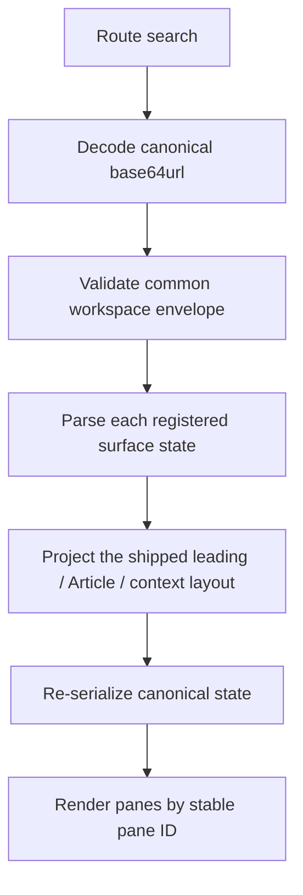
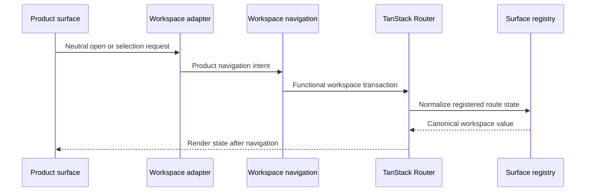

Devour represents the visible workspace in one canonical URL: `/workspace?workspace=...`. The `workspace` search value contains the ordered pane descriptors and focused pane ID needed to reconstruct the composition. TanStack Router owns that durable state; the app store does not mirror it.

This design gives copied links, reloads, and browser back and forward navigation the same source of truth as in-app navigation.

## The durable workspace value

The decoded workspace envelope has three fields:

| Field | Meaning |
| --- | --- |
| `version` | Version of the common workspace envelope |
| `panes` | Ordered descriptors containing a unique pane `id`, a registered `surfaceKind`, and JSON route state owned by that surface |
| `focusedPaneId` | The ID of the focused pane, or `null` only when the pane sequence is empty |

The common [workspace state owner](https://github.com/coreyconner/snewse/blob/master/apps/devour/src/app/workspace/workspaceState.ts) validates the envelope, identifiers, uniqueness, JSON shape, and serialization budgets. It treats each pane's `routeState` as opaque JSON. The [surface registry](https://github.com/coreyconner/snewse/blob/master/apps/devour/src/app/workspace/workspaceSurfaceRegistry.ts) performs the later semantic parse for the named surface.

The [route codec](https://github.com/coreyconner/snewse/blob/master/apps/devour/src/app/workspace/workspaceRouteState.ts) emits unpadded base64url over canonical JSON. The [route lifecycle](https://github.com/coreyconner/snewse/blob/master/apps/devour/src/app/workspace/workspaceRouteLifecycle.ts) runs the complete parse, surface normalization, current-layout projection, and reserialization path. Missing, malformed, or noncanonical input is replaced with a deterministic canonical URL. A missing or invalid workspace starts with one User Library pane.

<Note>
  The encoded value is application state, not an authorization token or a cache of Core data. Every mounted surface still loads its data under the current user's session and Core access rules. See [User Access](/developer/core/user-access).
</Note>

## Entry routes

Public-facing routes are adapters into the canonical workspace. They build validated workspace state and replace the current history entry with `/workspace`.

| Entry | Workspace produced |
| --- | --- |
| `/` | One User Library pane focused on the full library |
| `/articles/` | The same User Library entry |
| `/:contentId` | A User Library pane followed by a focused Article pane; `contentId` must be an Article UUID |
| `/topics/:topicKey` | One focused Topics Explore pane with that Topic selected |

The route files are [`index.tsx`](https://github.com/coreyconner/snewse/blob/master/apps/devour/src/routes/index.tsx), [`articles/index.tsx`](https://github.com/coreyconner/snewse/blob/master/apps/devour/src/routes/articles/index.tsx), [`$contentId.tsx`](https://github.com/coreyconner/snewse/blob/master/apps/devour/src/routes/%24contentId.tsx), and [`topics/$topicKey.tsx`](https://github.com/coreyconner/snewse/blob/master/apps/devour/src/routes/topics/%24topicKey.tsx). They reuse the same registered pane constructors as in-app navigation through [leading-entry helpers](https://github.com/coreyconner/snewse/blob/master/apps/devour/src/app/workspace/workspaceLeadingEntry.ts) and the [Article entry helper](https://github.com/coreyconner/snewse/blob/master/apps/devour/src/app/workspace/articleWorkspaceEntry.ts).

An invalid Article identifier returns the route's unavailable result instead of creating a different locator form. Article slugs remain display metadata and do not select an Article.

## Pane identity and order

A pane ID identifies one mounted workspace instance. It is distinct from the domain resource in the pane. Two panes can use the same surface kind, and a resource ID belongs inside the surface's route state.

The current product layout projects the durable sequence into at most one pane for each role:

- a leading pane, currently User Library or Topics Explore;
- a primary Article pane;
- a context pane, such as Topic, Unit Details, related Articles, annotations, or a Wayfinder result.

These roles describe placement. They are not domain types in the durable envelope. The [surface assembly](https://github.com/coreyconner/snewse/blob/master/apps/devour/src/app/workspace/workspaceSurfaceAssembly.tsx) identifies the shipped leading and Article kinds, while the [pane layout](https://github.com/coreyconner/snewse/blob/master/apps/devour/src/app/workspace/WorkspacePaneLayout.tsx) turns them into current viewport positions.

<Info>
  Responsive visibility and focus behavior are owned by the pane layout. Surface route state should describe product identity or selection, not columns, widths, or whether another pane is visible.
</Info>

## Navigation transactions

The workspace uses small immutable transactions instead of a second navigation store. Each transaction receives Router's latest pending workspace value, produces the next value, and serializes it back into the search parameter.

<Tabs sync={false}>
  <Tab title="Open from a pane">
    Opening a new branch keeps the source pane, removes the suffix after it, appends the new pane, and focuses that pane. This prevents an old context branch from surviving after its source changes.
  </Tab>
  <Tab title="Replace the leading pane">
    Choosing User Library or Topics Explore replaces the leading pane and preserves the remaining sequence when the replacement would not duplicate a pane ID.
  </Tab>
  <Tab title="Update a pane">
    A selection change replaces only that pane's validated route state. Its pane ID, surface kind, position, siblings, and focus remain stable.
  </Tab>
  <Tab title="Close a pane">
    Closing removes exactly that pane. If it was focused, focus moves to the preceding pane when possible, then to the pane that moved into its position.
  </Tab>
</Tabs>

The low-level transitions live in [`workspaceState.ts`](https://github.com/coreyconner/snewse/blob/master/apps/devour/src/app/workspace/workspaceState.ts). Registered open, replace, and update operations in [`workspaceSurfaceRegistry.ts`](https://github.com/coreyconner/snewse/blob/master/apps/devour/src/app/workspace/workspaceSurfaceRegistry.ts) require the owning surface parser, so an adapter cannot install unchecked route state.

Product surfaces do not call Router directly. They emit neutral requests to an app adapter. The [workspace navigation provider](https://github.com/coreyconner/snewse/blob/master/apps/devour/src/app/workspace/WorkspaceNavigation.tsx) chooses the source pane, creates pane identity, selects the registration, and applies the history policy.

## Browser history policy

Devour distinguishes committed structure from continuous synchronization.

| Intent | Examples | History behavior |
| --- | --- | --- |
| Committed structure | Open an Article, open a context surface, navigate the current Article, close a pane, or choose a different leading surface | Push a history entry |
| Continuous synchronization | Change the selected Collection or Topic within a pane, synchronize an Article selection, or update an existing result pane | Replace the current history entry |
| Entry or canonicalization | Enter from an alias, recover missing or malformed state, or rewrite noncanonical serialization | Replace the current history entry |

The policy is implemented by `createWorkspaceRouteTransactionNavigation` in the [route lifecycle](https://github.com/coreyconner/snewse/blob/master/apps/devour/src/app/workspace/workspaceRouteLifecycle.ts). Keeping that choice at the app seam lets modules express product outcomes without importing Router or deciding how many browser-history steps an interaction creates.

## From surface request to URL

The functional Router update is significant when interactions happen close together: each transaction receives the latest pending search state instead of a stale render snapshot. The resulting URL remains the durable record used by reload and history traversal.

<Columns cols={2}>
  <Card title="Devour architecture" icon="network" href="/developer/devour/overview">
    See how routes, adapters, modules, and shared blocks divide ownership.
  </Card>
  <Card title="Sessions, data, and state" icon="database" href="/developer/devour/state">
    Separate durable workspace state from server caches and transient UI state.
  </Card>
</Columns>
