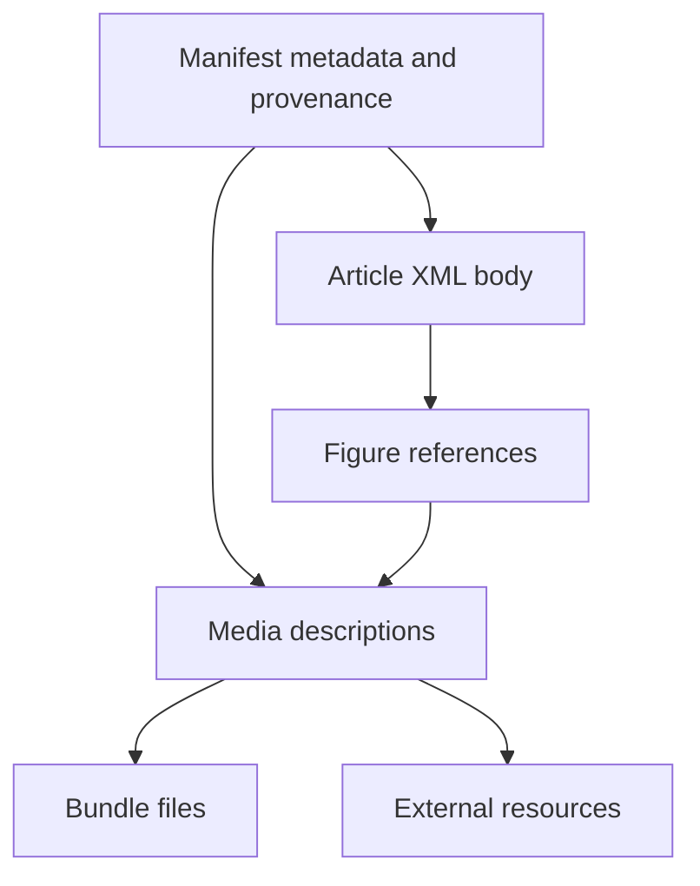

A Manifest describes captured editorial content and how to locate its body and Media.
Web Clipper and Studio produce this shared input; Core turns it into canonical
content through [ingestion](/developer/core/ingestion/overview). The format belongs
across those applications, independently of any one producer's interface.

## What travels together

The Manifest carries the Article's source identity and editorial metadata,
capture provenance, Media descriptions, and producer warnings. Its content
reference identifies [Article XML](/developer/manifest/article-xml), which carries
the ordered body. Media entries connect that body and Article-level roles to
either supplied files or external resources.

The [shared contracts](https://github.com/coreyconner/snewse/blob/master/packages/contracts/src/ingestionManifest.ts)
define the exact fields and validation. The
[contract examples](https://github.com/coreyconner/snewse/blob/master/packages/contracts/src/ingestionManifestExamples.ts)
provide a concrete Manifest and its submission payload without maintaining a
second schema here.

## A bundle and a submission are different containers

The captured content can be packaged for download or sent directly to Core.
Those representations carry the same content references but serve different tasks.

| Representation | How the pieces are connected |
| --- | --- |
| Downloaded ZIP | `manifest.json`, `article.xml`, and any supplied Media files retain their bundle-relative paths. External resources remain references. |
| Multipart submission | A payload carries the Manifest and maps content/file paths to multipart field names. XML and uploaded bytes travel in their corresponding parts. |

The Clipper's [ZIP builder](https://github.com/coreyconner/snewse/blob/master/apps/web-clipper/src/lib/downloadBundle.ts)
and [submission builder](https://github.com/coreyconner/snewse/blob/master/apps/web-clipper/src/lib/submitBundle.ts)
implement those representations. A downloaded ZIP is not itself the multipart
request body. Core's [submission and capture](/developer/core/ingestion/capture)
guide explains intake validation, receipts, and failure boundaries.

## Media references and source identity

A bundle-file source locates bytes supplied with the content. An external-URL
source names a resource without supplying those bytes. A Media role describes
how the resource relates to the Article; XML figure references identify body
placement. Describing a resource in the Manifest alone does not place it in the body.

The producer's IDs connect pieces of the submitted content. They should not be
treated as proof that a canonical database resource already exists. Core retains
source-to-canonical mappings during capture; see
[submission and capture](/developer/core/ingestion/capture) for identity resolution.
The [Media guide](/developer/core/media) explains the resulting resource and
delivery behavior.

## User intent stays outside captured content

Collection placement is optional request-level intent alongside the Manifest.
It describes what the authenticated user wants to do with this submission,
while the Manifest describes the content being captured.

<Note>
  Downloaded bundles contain captured content, not a user's Collection placement.
  Reprocessing stored source does not replay that user's organization request.
</Note>

The submission schema expresses this separation directly. Core's intake operation
coordinates acquisition and placement; [Collections](/developer/core/collections)
owns what membership means and [User Access](/developer/core/user-access) owns grants.
Provenance fields describe the capture and do not replace the authenticated caller.

## Producers and downstream consumers

Web Clipper builds a bundle from captured web content and selected Media. Studio's
upload builder creates the same shared format from authored body text, with no
original content URL or uploaded Media in its current path. Their serialization
and user interfaces remain application responsibilities:

- [Clipper bundle construction](https://github.com/coreyconner/snewse/blob/master/apps/web-clipper/src/lib/ingestionBundle.ts).
- [Studio upload construction](https://github.com/coreyconner/snewse/blob/master/apps/studio/src/lib/manifestSubmission.ts).

Devour's Article view consumes Core's structured Article/Unit/Media composition.
It does not need to parse the original submitted XML to render that content.
See [Articles](/developer/core/articles) for the composition boundary.

## Versions and historical material

New submissions are checked against the current public schema version declared
in the [Manifest contract](https://github.com/coreyconner/snewse/blob/master/packages/contracts/src/ingestionManifest.ts).
Storage compatibility is a separate boundary: Core retains supported historical
provenance with its original version label rather than relabeling it as current input.

<Warning>
  The top-level `manifest-workspace` contains historical bundles and transformer
  sketches. They are design references, not templates guaranteed to validate
  against current public intake.
</Warning>

The [historical workspace](https://github.com/coreyconner/snewse/tree/master/manifest-workspace)
preserves older examples. Current examples belong with contracts; supported
stored variants are declared in
[Article provenance](https://github.com/coreyconner/snewse/blob/master/apps/core/src/infrastructure/postgres/schema/article-provenance.ts).
Historical storage support does not make those formats valid for new submissions.
