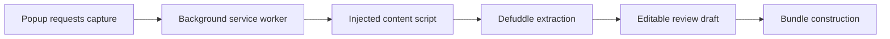

The Web Clipper captures the active Chrome tab, extracts article-shaped content with Defuddle, and presents a review form before it creates a SNEWSE bundle. Capture stays in the extension: Core receives the reviewed bundle rather than the tab DOM or Defuddle result.

## Capture across extension contexts

The popup asks the [background service worker](https://github.com/coreyconner/snewse/blob/master/apps/web-clipper/src/background/background.ts) to capture the active tab. The worker uses the `activeTab` and `scripting` permissions to inject the [content script](https://github.com/coreyconner/snewse/blob/master/apps/web-clipper/src/content/content.ts). The content script runs extraction against the page document and returns serializable capture data to the popup.

The [extraction boundary](https://github.com/coreyconner/snewse/blob/master/apps/web-clipper/src/lib/extraction.ts) keeps the source URL, extracted HTML and text, title, authors, publication and timestamps, a primary image, and a bounded Defuddle provenance summary. Missing publisher metadata remains visible as a review gap or bundle warning.

## Review changes the submitted content

The review draft begins with extracted title, author names, publication, timestamps, body text, and a generated slug. Before bundle construction, the popup validates the required review values.

Editing body text has a meaningful consequence. When the reviewed text still matches the extracted text, bundle construction can retain the extracted HTML structure. When the text changes, the Clipper uses the reviewed text as the content source rather than pretending the old HTML still represents it. The [bundle builder](https://github.com/coreyconner/snewse/blob/master/apps/web-clipper/src/lib/ingestionBundle.ts) owns that decision.

<Note>
  Capture provenance describes how the source was extracted. It does not make the extension an authority for canonical Articles, Units, or Media. Core establishes those identities during [submission and capture](/developer/core/ingestion/capture).
</Note>

Image captions and credits are best-effort enrichments from page and schema metadata. Browser access to the image URL determines whether bytes can later enter the bundle. See [bundle construction](/developer/web-clipper/bundles) for fallback behavior.

The Clipper intentionally covers article capture and review. It does not provide note creation, highlights, a user reading mode, or a general web archiving interface.
